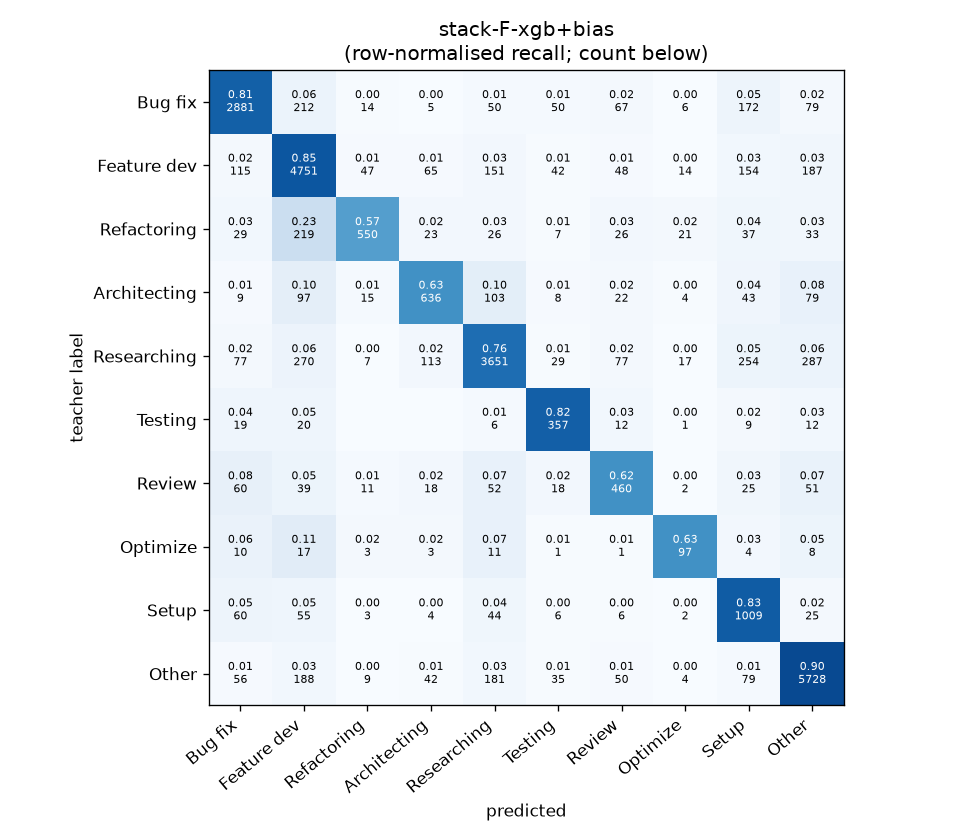
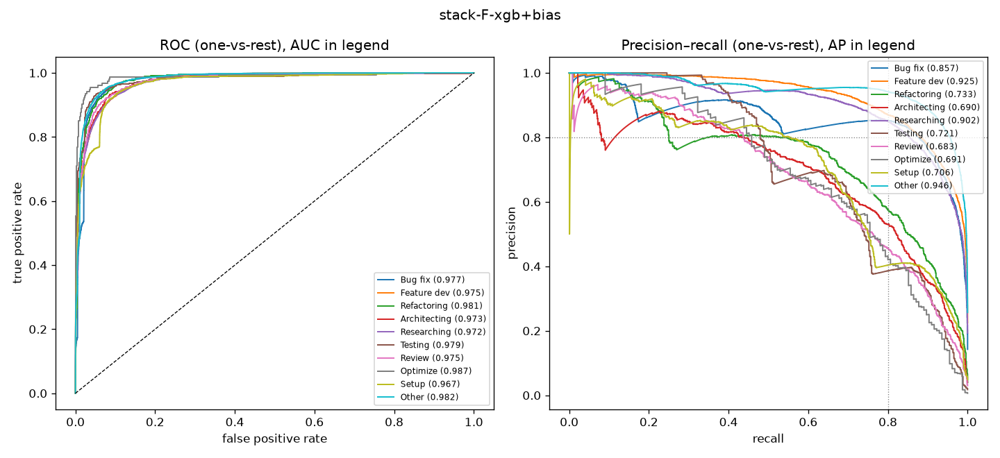

# stack-F-xgb+bias

```
{
 "block": 7,
 "features": "stack of emb-qwen3-8b-instr_lr, ft-qwen3-0.6b-lora",
 "model": "meta-XGBoost + cross-fitted class bias",
 "params": "{\"max_depth\": 3, \"learning_rate\": 0.05, \"subsample\": 0.8, \"colsample_bytree\": 0.8, \"min_child_weight\": 5, \"reg_lambda\": 1.0, \"tree_method\": \"hist\", \"n_jobs\": 8, \"eval_metric\": \"mlogloss\", \"best_iterations_per_fold\": [207, 195, 162, 189, 211], \"n_estimators_final\": 193, \"bias_all\": [-0.25, 0.0, -1.5, -0.5, -0.5, -1.5, 0.0, 0.25, -2.0, 0.0], \"bias_per_fold\": [[-1.25, -0.25, -1.5, -0.5, -0.5, 2.0, 0.0, 0.25, 1.75, 0.0], [-0.25, -0.25, -1.5, -0.5, -0.5, 2.0, 0.0, -0.25, -2.0, -0.5], [-1.25, -0.25, -0.5, -0.5, -0.75, -0.25, 0.0, 0.0, 1.25, 0.0], [0.75, -0.25, -0.5, 0.0, -0.5, -2.5, 0.0, 0.0, 2.0, -0.5], [-0.25, -0.25, -1.5, -0.5, -0.75, 2.0, 0.0, 0.5, 1.0, -0.25]]}"
}
```

### stack-F-xgb+bias

**Threshold metrics (argmax prediction)**

|              |   support (OOF) |   precision |   recall |    F1 | P 95% CI    | R 95% CI    | F1 95% CI   |   p(F1≤0.8) |
|:-------------|----------------:|------------:|---------:|------:|:------------|:------------|:------------|------------:|
| Bug fix      |            3536 |       0.869 |    0.815 | 0.841 | 0.846–0.889 | 0.790–0.838 | 0.821–0.857 |       0.000 |
| Feature dev  |            5574 |       0.810 |    0.852 | 0.830 | 0.792–0.828 | 0.834–0.870 | 0.816–0.844 |       0.000 |
| Refactoring  |             971 |       0.835 |    0.566 | 0.675 | 0.789–0.886 | 0.502–0.630 | 0.626–0.727 |       1.000 |
| Architecting |            1016 |       0.700 |    0.626 | 0.661 | 0.647–0.754 | 0.567–0.689 | 0.617–0.712 |       1.000 |
| Researching  |            4782 |       0.854 |    0.763 | 0.806 | 0.835–0.874 | 0.739–0.787 | 0.788–0.823 |       0.237 |
| Testing      |             436 |       0.646 |    0.819 | 0.722 | 0.581–0.719 | 0.743–0.890 | 0.664–0.778 |       0.997 |
| Review       |             736 |       0.598 |    0.625 | 0.611 | 0.547–0.663 | 0.554–0.690 | 0.565–0.667 |       1.000 |
| Optimize     |             155 |       0.577 |    0.626 | 0.601 | 0.455–0.714 | 0.487–0.769 | 0.479–0.725 |       1.000 |
| Setup        |            1214 |       0.565 |    0.831 | 0.673 | 0.529–0.600 | 0.789–0.871 | 0.640–0.703 |       1.000 |
| Other        |            6372 |       0.883 |    0.899 | 0.891 | 0.868–0.898 | 0.884–0.912 | 0.879–0.901 |       0.000 |

**Ranking metrics (class scores, one-vs-rest)**

|              |   ROC-AUC | ROC-AUC 95% CI   |   p(AUC=0.5) |   PR-AUC (AP) | PR-AUC 95% CI   |   PR-AUC chance (=prevalence) |
|:-------------|----------:|:-----------------|-------------:|--------------:|:----------------|------------------------------:|
| Bug fix      |     0.977 | 0.973–0.981      |        0.000 |         0.857 | 0.835–0.875     |                         0.143 |
| Feature dev  |     0.975 | 0.971–0.978      |        0.000 |         0.925 | 0.913–0.933     |                         0.225 |
| Refactoring  |     0.981 | 0.975–0.985      |        0.000 |         0.733 | 0.685–0.782     |                         0.039 |
| Architecting |     0.973 | 0.965–0.979      |        0.000 |         0.690 | 0.643–0.753     |                         0.041 |
| Researching  |     0.972 | 0.968–0.976      |        0.000 |         0.902 | 0.889–0.915     |                         0.193 |
| Testing      |     0.979 | 0.966–0.991      |        0.000 |         0.721 | 0.654–0.795     |                         0.018 |
| Review       |     0.975 | 0.964–0.983      |        0.000 |         0.683 | 0.622–0.752     |                         0.030 |
| Optimize     |     0.987 | 0.957–0.997      |        0.000 |         0.691 | 0.548–0.807     |                         0.006 |
| Setup        |     0.967 | 0.957–0.975      |        0.000 |         0.706 | 0.657–0.756     |                         0.049 |
| Other        |     0.982 | 0.979–0.984      |        0.000 |         0.946 | 0.937–0.954     |                         0.257 |

**Overall**

|                       |   value |      lo |      hi |   p-value |
|:----------------------|--------:|--------:|--------:|----------:|
| accuracy              |   0.812 |   0.801 |   0.821 |   nan     |
| macro-F1              |   0.731 |   0.713 |   0.750 |     0.005 |
| min-F1 (bar)          |   0.601 |   0.479 |   0.643 |     1.000 |
| classes with F1 ≥ 0.8 |   4.000 | nan     | nan     |   nan     |
| macro ROC-AUC         |   0.977 | nan     | nan     |   nan     |
| macro PR-AUC          |   0.785 | nan     | nan     |   nan     |




