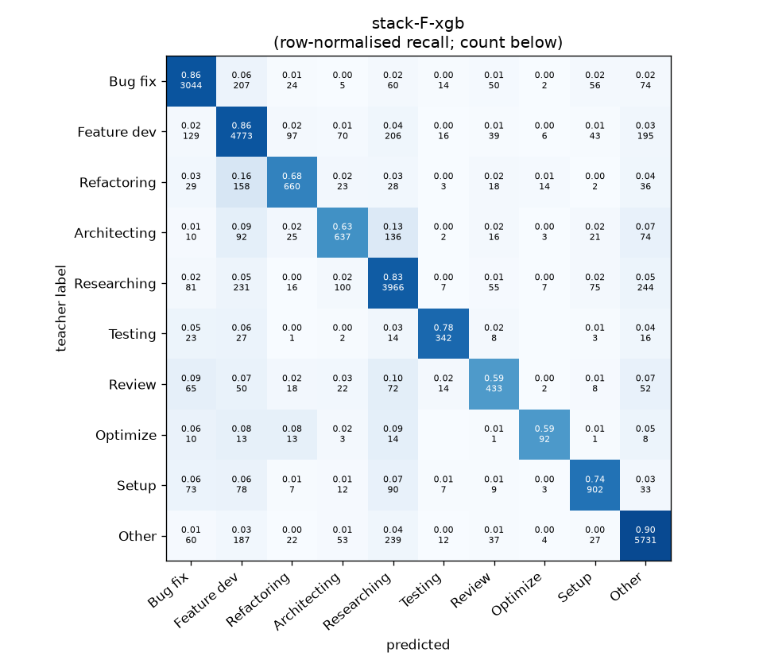
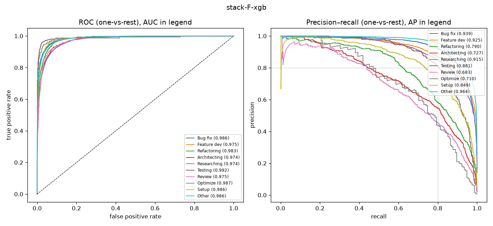

# stack-F-xgb

```
{
 "block": 7,
 "features": "stack of emb-qwen3-8b-instr_lr, ft-qwen3-0.6b-lora",
 "model": "meta-XGBoost",
 "params": "{\"max_depth\": 3, \"learning_rate\": 0.05, \"subsample\": 0.8, \"colsample_bytree\": 0.8, \"min_child_weight\": 5, \"reg_lambda\": 1.0, \"tree_method\": \"hist\", \"n_jobs\": 8, \"eval_metric\": \"mlogloss\", \"best_iterations_per_fold\": [207, 195, 162, 189, 211], \"n_estimators_final\": 193}"
}
```

### stack-F-xgb

**Threshold metrics (argmax prediction)**

|              |   support (OOF) |   precision |   recall |    F1 | P 95% CI    | R 95% CI    | F1 95% CI   |   p(F1≤0.8) |
|:-------------|----------------:|------------:|---------:|------:|:------------|:------------|:------------|------------:|
| Bug fix      |            3536 |       0.864 |    0.861 | 0.862 | 0.842–0.885 | 0.839–0.883 | 0.845–0.877 |       0.000 |
| Feature dev  |            5574 |       0.821 |    0.856 | 0.838 | 0.801–0.838 | 0.838–0.874 | 0.824–0.851 |       0.000 |
| Refactoring  |             971 |       0.747 |    0.680 | 0.712 | 0.700–0.802 | 0.617–0.737 | 0.665–0.757 |       1.000 |
| Architecting |            1016 |       0.687 |    0.627 | 0.656 | 0.641–0.740 | 0.567–0.689 | 0.611–0.706 |       1.000 |
| Researching  |            4782 |       0.822 |    0.829 | 0.826 | 0.803–0.841 | 0.809–0.850 | 0.810–0.841 |       0.000 |
| Testing      |             436 |       0.820 |    0.784 | 0.802 | 0.757–0.888 | 0.706–0.853 | 0.742–0.853 |       0.493 |
| Review       |             736 |       0.650 |    0.588 | 0.618 | 0.592–0.721 | 0.516–0.663 | 0.564–0.678 |       1.000 |
| Optimize     |             155 |       0.692 |    0.594 | 0.639 | 0.559–0.846 | 0.462–0.744 | 0.514–0.763 |       0.998 |
| Setup        |            1214 |       0.793 |    0.743 | 0.767 | 0.752–0.834 | 0.696–0.789 | 0.729–0.802 |       0.971 |
| Other        |            6372 |       0.887 |    0.899 | 0.893 | 0.871–0.902 | 0.884–0.912 | 0.881–0.904 |       0.000 |

**Ranking metrics (class scores, one-vs-rest)**

|              |   ROC-AUC | ROC-AUC 95% CI   |   p(AUC=0.5) |   PR-AUC (AP) | PR-AUC 95% CI   |   PR-AUC chance (=prevalence) |
|:-------------|----------:|:-----------------|-------------:|--------------:|:----------------|------------------------------:|
| Bug fix      |     0.986 | 0.983–0.989      |        0.000 |         0.939 | 0.925–0.950     |                         0.143 |
| Feature dev  |     0.975 | 0.971–0.978      |        0.000 |         0.925 | 0.913–0.933     |                         0.225 |
| Refactoring  |     0.983 | 0.977–0.987      |        0.000 |         0.790 | 0.747–0.832     |                         0.039 |
| Architecting |     0.974 | 0.965–0.980      |        0.000 |         0.727 | 0.685–0.774     |                         0.041 |
| Researching  |     0.974 | 0.970–0.977      |        0.000 |         0.915 | 0.904–0.925     |                         0.193 |
| Testing      |     0.992 | 0.983–0.997      |        0.000 |         0.881 | 0.837–0.917     |                         0.018 |
| Review       |     0.975 | 0.964–0.983      |        0.000 |         0.683 | 0.622–0.752     |                         0.030 |
| Optimize     |     0.987 | 0.958–0.998      |        0.000 |         0.710 | 0.578–0.823     |                         0.006 |
| Setup        |     0.986 | 0.980–0.990      |        0.000 |         0.849 | 0.811–0.878     |                         0.049 |
| Other        |     0.986 | 0.983–0.988      |        0.000 |         0.964 | 0.958–0.970     |                         0.257 |

**Overall**

|                       |   value |      lo |      hi |   p-value |
|:----------------------|--------:|--------:|--------:|----------:|
| accuracy              |   0.830 |   0.821 |   0.839 |   nan     |
| macro-F1              |   0.761 |   0.743 |   0.781 |     0.005 |
| min-F1 (bar)          |   0.618 |   0.514 |   0.657 |     1.000 |
| classes with F1 ≥ 0.8 |   5.000 | nan     | nan     |   nan     |
| macro ROC-AUC         |   0.982 | nan     | nan     |   nan     |
| macro PR-AUC          |   0.838 | nan     | nan     |   nan     |




