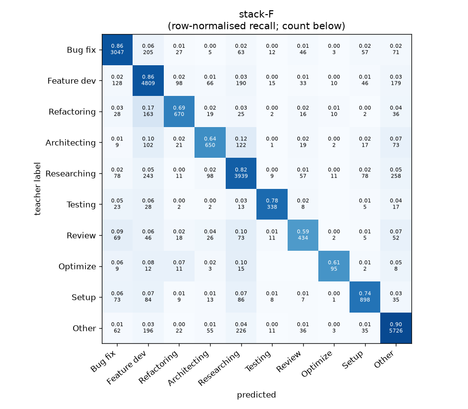
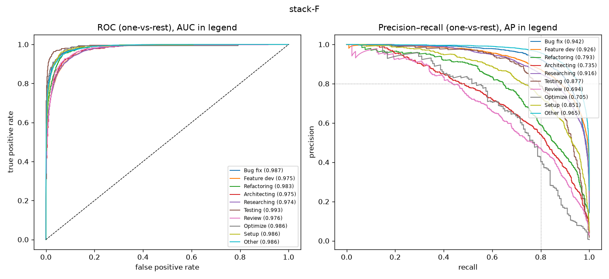

# stack-F

```
{
 "block": 7,
 "features": "stack of emb-qwen3-8b-instr_lr, ft-qwen3-0.6b-lora",
 "model": "meta-LR",
 "params": "{\"C\": 1.0, \"cw\": null}"
}
```

### stack-F

**Threshold metrics (argmax prediction)**

|              |   support (OOF) |   precision |   recall |    F1 | P 95% CI    | R 95% CI    | F1 95% CI   |   p(F1≤0.8) |
|:-------------|----------------:|------------:|---------:|------:|:------------|:------------|:------------|------------:|
| Bug fix      |            3536 |       0.864 |    0.862 | 0.863 | 0.844–0.885 | 0.839–0.885 | 0.847–0.878 |       0.000 |
| Feature dev  |            5574 |       0.817 |    0.863 | 0.839 | 0.798–0.834 | 0.846–0.879 | 0.826–0.852 |       0.000 |
| Refactoring  |             971 |       0.754 |    0.690 | 0.720 | 0.704–0.809 | 0.630–0.749 | 0.676–0.765 |       1.000 |
| Architecting |            1016 |       0.694 |    0.640 | 0.666 | 0.646–0.746 | 0.579–0.697 | 0.620–0.713 |       1.000 |
| Researching  |            4782 |       0.829 |    0.824 | 0.826 | 0.810–0.849 | 0.804–0.844 | 0.811–0.842 |       0.001 |
| Testing      |             436 |       0.830 |    0.775 | 0.802 | 0.766–0.894 | 0.697–0.853 | 0.745–0.856 |       0.498 |
| Review       |             736 |       0.662 |    0.590 | 0.624 | 0.609–0.731 | 0.516–0.663 | 0.569–0.684 |       1.000 |
| Optimize     |             155 |       0.693 |    0.613 | 0.651 | 0.564–0.848 | 0.462–0.769 | 0.528–0.767 |       0.996 |
| Setup        |            1214 |       0.784 |    0.740 | 0.761 | 0.742–0.825 | 0.690–0.785 | 0.725–0.797 |       0.985 |
| Other        |            6372 |       0.887 |    0.899 | 0.893 | 0.872–0.903 | 0.883–0.912 | 0.881–0.904 |       0.000 |

**Ranking metrics (class scores, one-vs-rest)**

|              |   ROC-AUC | ROC-AUC 95% CI   |   p(AUC=0.5) |   PR-AUC (AP) | PR-AUC 95% CI   |   PR-AUC chance (=prevalence) |
|:-------------|----------:|:-----------------|-------------:|--------------:|:----------------|------------------------------:|
| Bug fix      |     0.987 | 0.984–0.990      |        0.000 |         0.942 | 0.930–0.952     |                         0.143 |
| Feature dev  |     0.975 | 0.971–0.978      |        0.000 |         0.926 | 0.914–0.933     |                         0.225 |
| Refactoring  |     0.983 | 0.977–0.988      |        0.000 |         0.793 | 0.752–0.837     |                         0.039 |
| Architecting |     0.975 | 0.968–0.981      |        0.000 |         0.735 | 0.695–0.782     |                         0.041 |
| Researching  |     0.974 | 0.970–0.978      |        0.000 |         0.916 | 0.905–0.927     |                         0.193 |
| Testing      |     0.993 | 0.984–0.997      |        0.000 |         0.877 | 0.826–0.917     |                         0.018 |
| Review       |     0.976 | 0.966–0.984      |        0.000 |         0.694 | 0.637–0.760     |                         0.030 |
| Optimize     |     0.986 | 0.952–0.996      |        0.000 |         0.705 | 0.572–0.823     |                         0.006 |
| Setup        |     0.986 | 0.981–0.990      |        0.000 |         0.851 | 0.820–0.878     |                         0.049 |
| Other        |     0.986 | 0.983–0.988      |        0.000 |         0.965 | 0.959–0.970     |                         0.257 |

**Overall**

|                       |   value |      lo |      hi |   p-value |
|:----------------------|--------:|--------:|--------:|----------:|
| accuracy              |   0.831 |   0.822 |   0.840 |   nan     |
| macro-F1              |   0.764 |   0.747 |   0.784 |     0.005 |
| min-F1 (bar)          |   0.624 |   0.528 |   0.663 |     1.000 |
| classes with F1 ≥ 0.8 |   5.000 | nan     | nan     |   nan     |
| macro ROC-AUC         |   0.982 | nan     | nan     |   nan     |
| macro PR-AUC          |   0.840 | nan     | nan     |   nan     |




