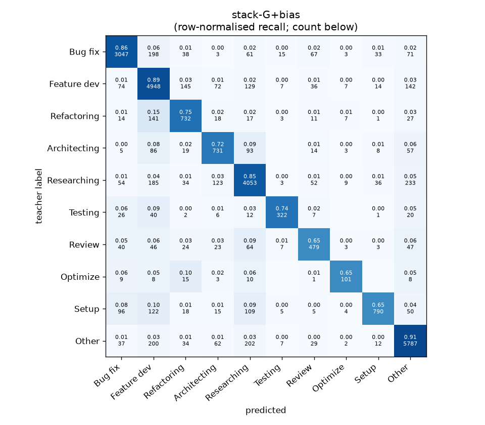
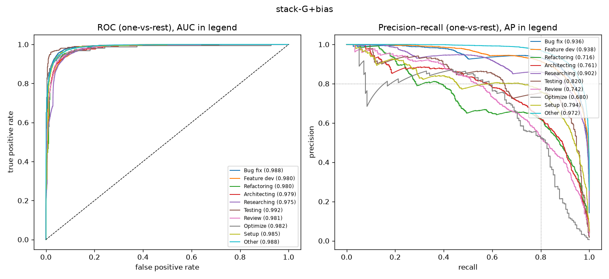

# stack-G+bias

```
{
 "block": 7,
 "features": "stack of ft-qwen3-8b-lora, ft-qwen3-0.6b-lora, emb-qwen3-8b-instr_lr, emb-qwen3-8b-instr_svm, tfidf-WC_lr, emb-qwen3-0.6b-instr_lr",
 "model": "meta-LR + cross-fitted class bias",
 "params": "{\"C\": 1.0, \"cw\": null, \"bias_all\": [-0.25, 0.25, -0.25, 0.5, 0.0, -0.5, 0.0, 0.25, -0.25, 0.0], \"bias_per_fold\": [[-0.25, 0.25, -0.75, 0.5, 0.0, -0.75, 0.0, 0.25, -2.0, 0.0], [-0.75, 0.0, -0.5, 0.25, 0.25, -0.5, 0.0, 0.0, -1.5, 0.0], [-0.25, 0.25, 1.5, 0.25, 0.0, -2.75, 0.0, 0.0, -0.75, 0.0], [-0.25, 0.25, 1.5, 0.25, 0.25, -0.75, 0.0, 0.0, -2.0, 0.0], [-0.75, 0.25, 0.5, 0.5, -0.75, -1.25, 0.0, 0.0, -0.5, 0.0]]}"
}
```

### stack-G+bias

**Threshold metrics (argmax prediction)**

|              |   support (OOF) |   precision |   recall |    F1 | P 95% CI    | R 95% CI    | F1 95% CI   |   p(F1≤0.8) |
|:-------------|----------------:|------------:|---------:|------:|:------------|:------------|:------------|------------:|
| Bug fix      |            3536 |       0.896 |    0.862 | 0.878 | 0.876–0.915 | 0.839–0.885 | 0.862–0.894 |       0.000 |
| Feature dev  |            5574 |       0.828 |    0.888 | 0.857 | 0.811–0.848 | 0.871–0.903 | 0.844–0.870 |       0.000 |
| Refactoring  |             971 |       0.690 |    0.754 | 0.720 | 0.646–0.740 | 0.695–0.807 | 0.679–0.763 |       1.000 |
| Architecting |            1016 |       0.692 |    0.719 | 0.706 | 0.644–0.744 | 0.665–0.776 | 0.660–0.749 |       1.000 |
| Researching  |            4782 |       0.853 |    0.848 | 0.850 | 0.836–0.872 | 0.826–0.870 | 0.835–0.866 |       0.000 |
| Testing      |             436 |       0.873 |    0.739 | 0.800 | 0.804–0.938 | 0.660–0.817 | 0.736–0.854 |       0.532 |
| Review       |             736 |       0.683 |    0.651 | 0.667 | 0.628–0.750 | 0.582–0.723 | 0.613–0.724 |       1.000 |
| Optimize     |             155 |       0.727 |    0.652 | 0.687 | 0.590–0.862 | 0.513–0.795 | 0.568–0.795 |       0.980 |
| Setup        |            1214 |       0.880 |    0.651 | 0.748 | 0.838–0.921 | 0.601–0.703 | 0.706–0.790 |       0.997 |
| Other        |            6372 |       0.898 |    0.908 | 0.903 | 0.883–0.911 | 0.893–0.922 | 0.892–0.913 |       0.000 |

**Ranking metrics (class scores, one-vs-rest)**

|              |   ROC-AUC | ROC-AUC 95% CI   |   p(AUC=0.5) |   PR-AUC (AP) | PR-AUC 95% CI   |   PR-AUC chance (=prevalence) |
|:-------------|----------:|:-----------------|-------------:|--------------:|:----------------|------------------------------:|
| Bug fix      |     0.988 | 0.986–0.991      |        0.000 |         0.936 | 0.921–0.948     |                         0.143 |
| Feature dev  |     0.980 | 0.977–0.983      |        0.000 |         0.938 | 0.928–0.946     |                         0.225 |
| Refactoring  |     0.980 | 0.974–0.985      |        0.000 |         0.716 | 0.677–0.762     |                         0.039 |
| Architecting |     0.979 | 0.973–0.985      |        0.000 |         0.761 | 0.712–0.805     |                         0.041 |
| Researching  |     0.975 | 0.972–0.979      |        0.000 |         0.902 | 0.888–0.917     |                         0.193 |
| Testing      |     0.992 | 0.982–0.997      |        0.000 |         0.820 | 0.752–0.874     |                         0.018 |
| Review       |     0.981 | 0.972–0.988      |        0.000 |         0.742 | 0.677–0.801     |                         0.030 |
| Optimize     |     0.982 | 0.943–0.997      |        0.000 |         0.680 | 0.526–0.832     |                         0.006 |
| Setup        |     0.985 | 0.980–0.989      |        0.000 |         0.794 | 0.755–0.835     |                         0.049 |
| Other        |     0.988 | 0.987–0.990      |        0.000 |         0.972 | 0.967–0.976     |                         0.257 |

**Overall**

|                       |   value |      lo |      hi |   p-value |
|:----------------------|--------:|--------:|--------:|----------:|
| accuracy              |   0.847 |   0.838 |   0.855 |   nan     |
| macro-F1              |   0.782 |   0.764 |   0.799 |     0.005 |
| min-F1 (bar)          |   0.667 |   0.568 |   0.703 |     1.000 |
| classes with F1 ≥ 0.8 |   4.000 | nan     | nan     |   nan     |
| macro ROC-AUC         |   0.983 | nan     | nan     |   nan     |
| macro PR-AUC          |   0.826 | nan     | nan     |   nan     |




