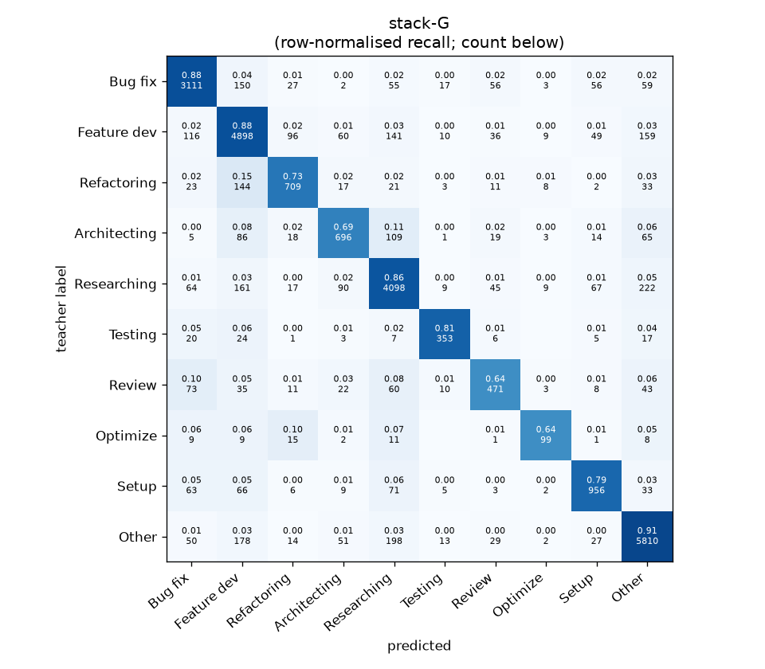
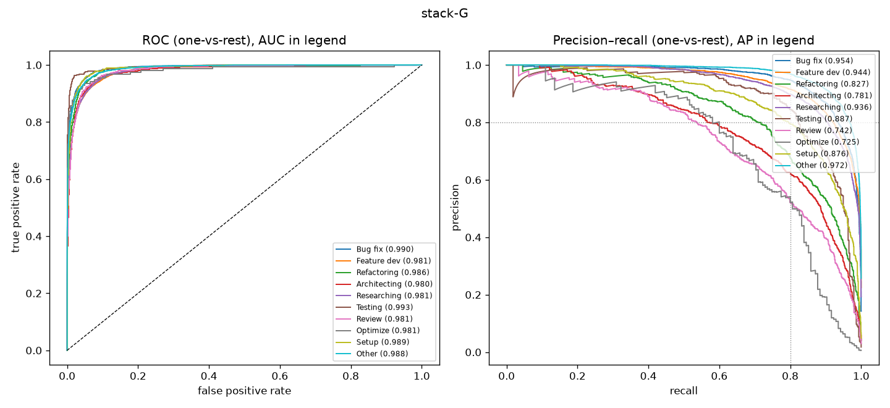

# stack-G

```
{
 "block": 7,
 "features": "stack of ft-qwen3-8b-lora, ft-qwen3-0.6b-lora, emb-qwen3-8b-instr_lr, emb-qwen3-8b-instr_svm, tfidf-WC_lr, emb-qwen3-0.6b-instr_lr",
 "model": "meta-LR",
 "params": "{\"C\": 1.0, \"cw\": null}"
}
```

### stack-G

**Threshold metrics (argmax prediction)**

|              |   support (OOF) |   precision |   recall |    F1 | P 95% CI    | R 95% CI    | F1 95% CI   |   p(F1≤0.8) |
|:-------------|----------------:|------------:|---------:|------:|:------------|:------------|:------------|------------:|
| Bug fix      |            3536 |       0.880 |    0.880 | 0.880 | 0.859–0.900 | 0.859–0.900 | 0.865–0.895 |       0.000 |
| Feature dev  |            5574 |       0.852 |    0.879 | 0.865 | 0.835–0.870 | 0.862–0.895 | 0.851–0.878 |       0.000 |
| Refactoring  |             971 |       0.776 |    0.730 | 0.752 | 0.726–0.824 | 0.679–0.786 | 0.709–0.793 |       0.985 |
| Architecting |            1016 |       0.731 |    0.685 | 0.707 | 0.681–0.783 | 0.626–0.748 | 0.660–0.750 |       1.000 |
| Researching  |            4782 |       0.859 |    0.857 | 0.858 | 0.841–0.878 | 0.837–0.877 | 0.844–0.872 |       0.000 |
| Testing      |             436 |       0.838 |    0.810 | 0.824 | 0.771–0.899 | 0.725–0.872 | 0.769–0.873 |       0.217 |
| Review       |             736 |       0.696 |    0.640 | 0.667 | 0.641–0.763 | 0.571–0.712 | 0.615–0.726 |       1.000 |
| Optimize     |             155 |       0.717 |    0.639 | 0.676 | 0.583–0.861 | 0.513–0.769 | 0.557–0.789 |       0.990 |
| Setup        |            1214 |       0.807 |    0.787 | 0.797 | 0.765–0.849 | 0.743–0.832 | 0.763–0.831 |       0.569 |
| Other        |            6372 |       0.901 |    0.912 | 0.906 | 0.887–0.914 | 0.898–0.925 | 0.896–0.916 |       0.000 |

**Ranking metrics (class scores, one-vs-rest)**

|              |   ROC-AUC | ROC-AUC 95% CI   |   p(AUC=0.5) |   PR-AUC (AP) | PR-AUC 95% CI   |   PR-AUC chance (=prevalence) |
|:-------------|----------:|:-----------------|-------------:|--------------:|:----------------|------------------------------:|
| Bug fix      |     0.990 | 0.988–0.992      |        0.000 |         0.954 | 0.943–0.962     |                         0.143 |
| Feature dev  |     0.981 | 0.978–0.984      |        0.000 |         0.944 | 0.935–0.951     |                         0.225 |
| Refactoring  |     0.986 | 0.981–0.990      |        0.000 |         0.827 | 0.792–0.864     |                         0.039 |
| Architecting |     0.980 | 0.973–0.986      |        0.000 |         0.781 | 0.740–0.821     |                         0.041 |
| Researching  |     0.981 | 0.978–0.984      |        0.000 |         0.936 | 0.927–0.946     |                         0.193 |
| Testing      |     0.993 | 0.984–0.998      |        0.000 |         0.887 | 0.823–0.932     |                         0.018 |
| Review       |     0.981 | 0.972–0.988      |        0.000 |         0.742 | 0.677–0.801     |                         0.030 |
| Optimize     |     0.981 | 0.941–0.997      |        0.000 |         0.725 | 0.600–0.848     |                         0.006 |
| Setup        |     0.989 | 0.985–0.993      |        0.000 |         0.876 | 0.849–0.901     |                         0.049 |
| Other        |     0.988 | 0.987–0.990      |        0.000 |         0.972 | 0.967–0.976     |                         0.257 |

**Overall**

|                       |   value |      lo |      hi |   p-value |
|:----------------------|--------:|--------:|--------:|----------:|
| accuracy              |   0.855 |   0.846 |   0.863 |   nan     |
| macro-F1              |   0.793 |   0.776 |   0.811 |     0.005 |
| min-F1 (bar)          |   0.667 |   0.557 |   0.702 |     1.000 |
| classes with F1 ≥ 0.8 |   5.000 | nan     | nan     |   nan     |
| macro ROC-AUC         |   0.985 | nan     | nan     |   nan     |
| macro PR-AUC          |   0.864 | nan     | nan     |   nan     |




