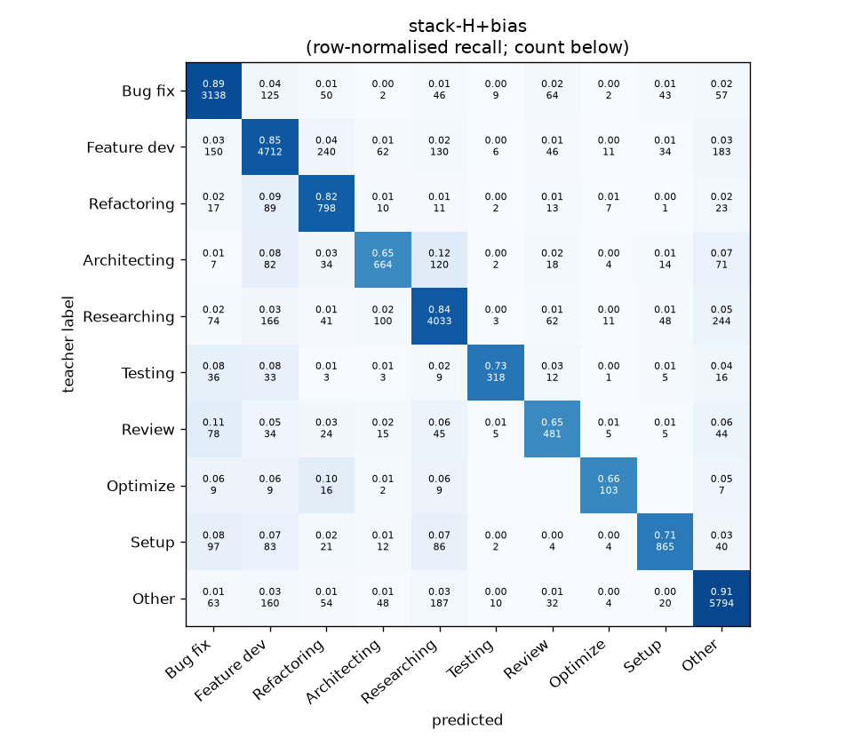
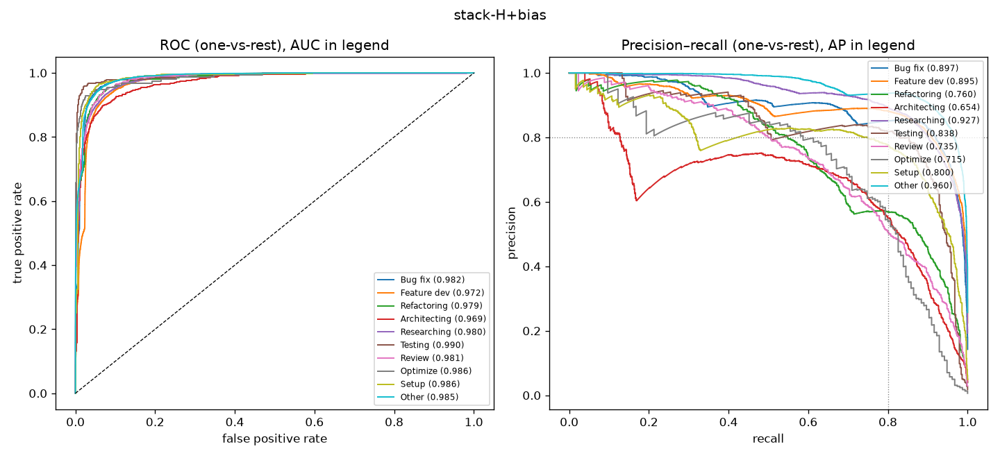

# stack-H+bias

```
{
 "block": 7,
 "features": "stack of ft-qwen3-8b-lora, emb-qwen3-8b-instr_lr",
 "model": "meta-LR + cross-fitted class bias",
 "params": "{\"C\": 1.0, \"cw\": null, \"bias_all\": [0.0, -0.75, 1.25, -0.75, -0.25, -1.25, 0.0, 0.25, -1.25, 0.0], \"bias_per_fold\": [[0.0, -0.75, 1.25, -0.75, -0.25, -0.5, 0.0, 0.25, -0.25, 0.0], [-1.0, 0.0, -1.0, -0.75, -0.25, -2.25, 0.0, 0.5, -1.25, 0.0], [0.75, -0.25, 1.25, -0.75, -0.25, -2.25, 0.0, 0.5, -1.25, 0.0], [-0.25, -0.75, 1.25, -0.75, -0.25, -1.25, 0.0, 0.0, 0.0, 0.0], [0.75, 0.25, 1.25, 1.0, -0.5, -1.0, 0.0, 0.25, -1.25, -0.5]]}"
}
```

### stack-H+bias

**Threshold metrics (argmax prediction)**

|              |   support (OOF) |   precision |   recall |    F1 | P 95% CI    | R 95% CI    | F1 95% CI   |   p(F1≤0.8) |
|:-------------|----------------:|------------:|---------:|------:|:------------|:------------|:------------|------------:|
| Bug fix      |            3536 |       0.855 |    0.887 | 0.871 | 0.835–0.878 | 0.868–0.908 | 0.856–0.886 |       0.000 |
| Feature dev  |            5574 |       0.858 |    0.845 | 0.852 | 0.841–0.875 | 0.827–0.865 | 0.837–0.864 |       0.000 |
| Refactoring  |             971 |       0.623 |    0.822 | 0.709 | 0.583–0.670 | 0.770–0.868 | 0.671–0.749 |       1.000 |
| Architecting |            1016 |       0.723 |    0.654 | 0.687 | 0.672–0.773 | 0.594–0.713 | 0.641–0.732 |       1.000 |
| Researching  |            4782 |       0.862 |    0.843 | 0.853 | 0.846–0.881 | 0.824–0.865 | 0.839–0.868 |       0.000 |
| Testing      |             436 |       0.891 |    0.729 | 0.802 | 0.828–0.952 | 0.642–0.817 | 0.738–0.859 |       0.500 |
| Review       |             736 |       0.657 |    0.654 | 0.655 | 0.602–0.724 | 0.587–0.728 | 0.603–0.714 |       1.000 |
| Optimize     |             155 |       0.678 |    0.665 | 0.671 | 0.556–0.824 | 0.538–0.795 | 0.557–0.781 |       0.990 |
| Setup        |            1214 |       0.836 |    0.713 | 0.769 | 0.793–0.877 | 0.663–0.762 | 0.730–0.805 |       0.952 |
| Other        |            6372 |       0.894 |    0.909 | 0.902 | 0.880–0.907 | 0.895–0.922 | 0.891–0.912 |       0.000 |

**Ranking metrics (class scores, one-vs-rest)**

|              |   ROC-AUC | ROC-AUC 95% CI   |   p(AUC=0.5) |   PR-AUC (AP) | PR-AUC 95% CI   |   PR-AUC chance (=prevalence) |
|:-------------|----------:|:-----------------|-------------:|--------------:|:----------------|------------------------------:|
| Bug fix      |     0.982 | 0.978–0.986      |        0.000 |         0.897 | 0.880–0.916     |                         0.143 |
| Feature dev  |     0.972 | 0.968–0.976      |        0.000 |         0.895 | 0.881–0.908     |                         0.225 |
| Refactoring  |     0.979 | 0.971–0.984      |        0.000 |         0.760 | 0.720–0.800     |                         0.039 |
| Architecting |     0.969 | 0.960–0.978      |        0.000 |         0.654 | 0.602–0.713     |                         0.041 |
| Researching  |     0.980 | 0.976–0.983      |        0.000 |         0.927 | 0.916–0.938     |                         0.193 |
| Testing      |     0.990 | 0.979–0.997      |        0.000 |         0.838 | 0.780–0.893     |                         0.018 |
| Review       |     0.981 | 0.970–0.988      |        0.000 |         0.735 | 0.670–0.798     |                         0.030 |
| Optimize     |     0.986 | 0.960–0.998      |        0.000 |         0.715 | 0.565–0.853     |                         0.006 |
| Setup        |     0.986 | 0.981–0.991      |        0.000 |         0.800 | 0.751–0.848     |                         0.049 |
| Other        |     0.985 | 0.983–0.987      |        0.000 |         0.960 | 0.953–0.966     |                         0.257 |

**Overall**

|                       |   value |      lo |      hi |   p-value |
|:----------------------|--------:|--------:|--------:|----------:|
| accuracy              |   0.843 |   0.834 |   0.852 |   nan     |
| macro-F1              |   0.777 |   0.759 |   0.794 |     0.005 |
| min-F1 (bar)          |   0.655 |   0.557 |   0.686 |     1.000 |
| classes with F1 ≥ 0.8 |   5.000 | nan     | nan     |   nan     |
| macro ROC-AUC         |   0.981 | nan     | nan     |   nan     |
| macro PR-AUC          |   0.818 | nan     | nan     |   nan     |




