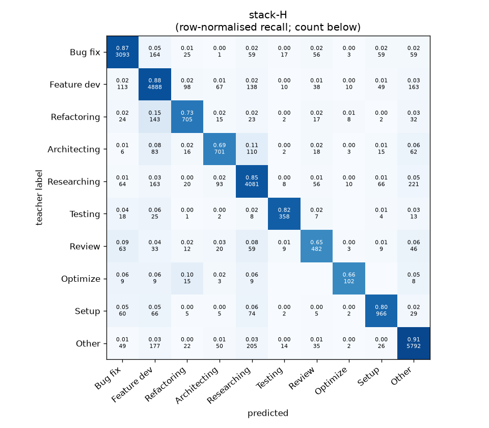
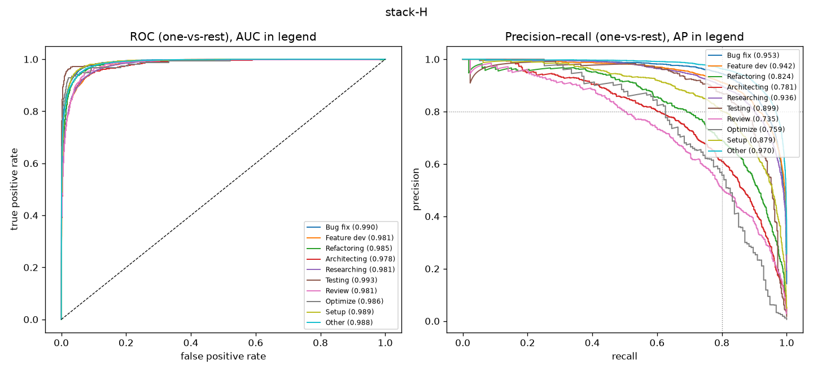

# stack-H

```
{
 "block": 7,
 "features": "stack of ft-qwen3-8b-lora, emb-qwen3-8b-instr_lr",
 "model": "meta-LR",
 "params": "{\"C\": 1.0, \"cw\": null}"
}
```

### stack-H

**Threshold metrics (argmax prediction)**

|              |   support (OOF) |   precision |   recall |    F1 | P 95% CI    | R 95% CI    | F1 95% CI   |   p(F1≤0.8) |
|:-------------|----------------:|------------:|---------:|------:|:------------|:------------|:------------|------------:|
| Bug fix      |            3536 |       0.884 |    0.875 | 0.879 | 0.864–0.904 | 0.854–0.896 | 0.863–0.894 |       0.000 |
| Feature dev  |            5574 |       0.850 |    0.877 | 0.863 | 0.831–0.867 | 0.859–0.892 | 0.849–0.875 |       0.000 |
| Refactoring  |             971 |       0.767 |    0.726 | 0.746 | 0.718–0.818 | 0.671–0.782 | 0.703–0.787 |       0.992 |
| Architecting |            1016 |       0.732 |    0.690 | 0.711 | 0.682–0.781 | 0.634–0.748 | 0.664–0.752 |       1.000 |
| Researching  |            4782 |       0.856 |    0.853 | 0.855 | 0.839–0.874 | 0.834–0.874 | 0.841–0.869 |       0.000 |
| Testing      |             436 |       0.848 |    0.821 | 0.834 | 0.782–0.913 | 0.743–0.881 | 0.779–0.885 |       0.114 |
| Review       |             736 |       0.675 |    0.655 | 0.665 | 0.619–0.739 | 0.587–0.723 | 0.613–0.723 |       1.000 |
| Optimize     |             155 |       0.713 |    0.658 | 0.685 | 0.581–0.857 | 0.513–0.795 | 0.568–0.800 |       0.979 |
| Setup        |            1214 |       0.808 |    0.796 | 0.802 | 0.771–0.848 | 0.752–0.835 | 0.768–0.834 |       0.480 |
| Other        |            6372 |       0.901 |    0.909 | 0.905 | 0.888–0.914 | 0.894–0.923 | 0.894–0.915 |       0.000 |

**Ranking metrics (class scores, one-vs-rest)**

|              |   ROC-AUC | ROC-AUC 95% CI   |   p(AUC=0.5) |   PR-AUC (AP) | PR-AUC 95% CI   |   PR-AUC chance (=prevalence) |
|:-------------|----------:|:-----------------|-------------:|--------------:|:----------------|------------------------------:|
| Bug fix      |     0.990 | 0.987–0.992      |        0.000 |         0.953 | 0.941–0.961     |                         0.143 |
| Feature dev  |     0.981 | 0.978–0.983      |        0.000 |         0.942 | 0.932–0.949     |                         0.225 |
| Refactoring  |     0.985 | 0.979–0.990      |        0.000 |         0.824 | 0.785–0.863     |                         0.039 |
| Architecting |     0.978 | 0.970–0.984      |        0.000 |         0.781 | 0.736–0.823     |                         0.041 |
| Researching  |     0.981 | 0.977–0.984      |        0.000 |         0.936 | 0.925–0.945     |                         0.193 |
| Testing      |     0.993 | 0.985–0.998      |        0.000 |         0.899 | 0.839–0.942     |                         0.018 |
| Review       |     0.981 | 0.970–0.988      |        0.000 |         0.735 | 0.670–0.798     |                         0.030 |
| Optimize     |     0.986 | 0.959–0.998      |        0.000 |         0.759 | 0.639–0.858     |                         0.006 |
| Setup        |     0.989 | 0.984–0.993      |        0.000 |         0.879 | 0.851–0.902     |                         0.049 |
| Other        |     0.988 | 0.986–0.990      |        0.000 |         0.970 | 0.965–0.974     |                         0.257 |

**Overall**

|                       |   value |      lo |      hi |   p-value |
|:----------------------|--------:|--------:|--------:|----------:|
| accuracy              |   0.854 |   0.844 |   0.862 |   nan     |
| macro-F1              |   0.794 |   0.777 |   0.812 |     0.005 |
| min-F1 (bar)          |   0.665 |   0.568 |   0.703 |     1.000 |
| classes with F1 ≥ 0.8 |   6.000 | nan     | nan     |   nan     |
| macro ROC-AUC         |   0.985 | nan     | nan     |   nan     |
| macro PR-AUC          |   0.868 | nan     | nan     |   nan     |




