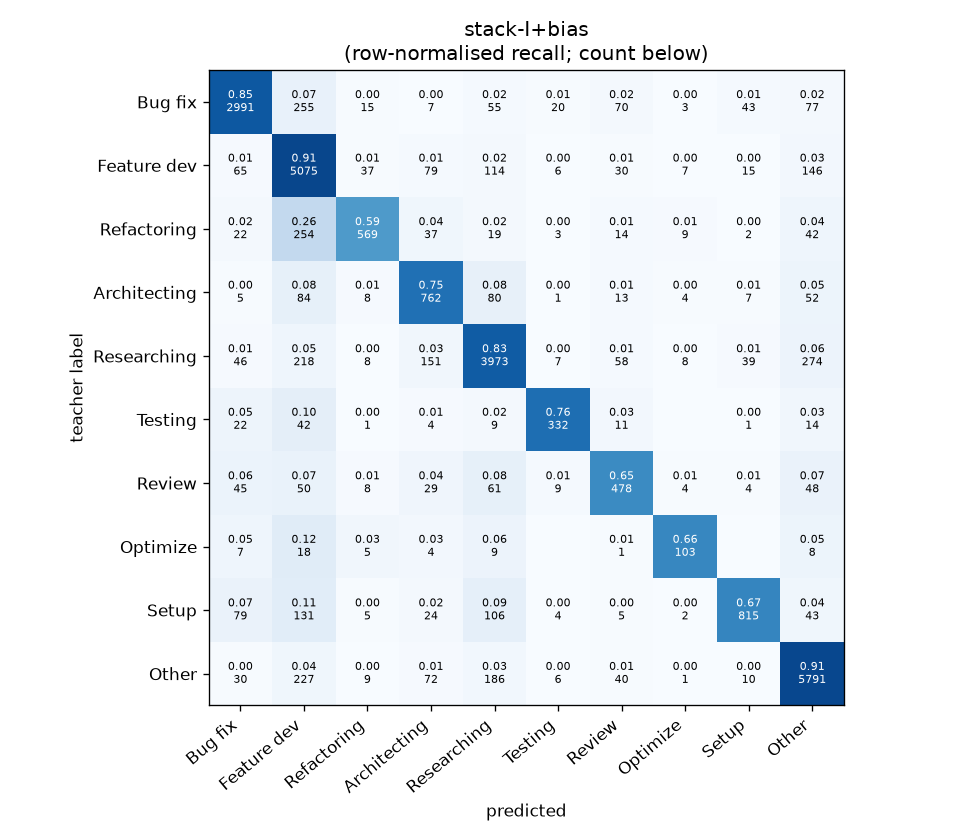
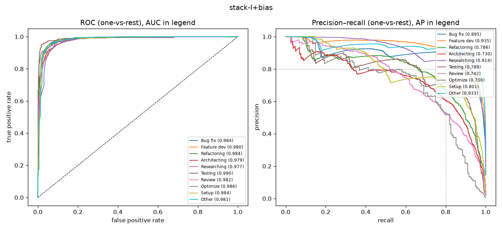

# stack-I+bias

```
{
 "block": 7,
 "features": "stack of ft-qwen3-8b-lora, ft-qwen3-0.6b-lora, emb-qwen3-8b-instr_lr",
 "model": "meta-LR + cross-fitted class bias",
 "params": "{\"C\": 1.0, \"cw\": null, \"bias_all\": [-0.75, 0.25, 0.25, 1.0, -1.0, -3.0, 0.0, 0.25, -0.5, 0.25], \"bias_per_fold\": [[0.5, 0.25, -1.25, 0.75, 0.0, -2.75, 0.0, 0.25, -0.5, -0.25], [-1.25, 0.25, -1.25, 0.25, 0.0, 0.5, 0.0, 0.0, -0.75, 0.0], [-1.25, 0.25, -0.25, 1.0, -1.0, -0.25, 0.0, 0.25, -0.5, 0.75], [-0.75, 0.25, -1.25, 0.75, 0.0, -1.25, 0.0, 0.0, -2.25, 0.0], [-0.75, 0.5, -1.0, 0.25, 0.0, -1.25, 0.0, -0.5, -2.25, -0.5]]}"
}
```

### stack-I+bias

**Threshold metrics (argmax prediction)**

|              |   support (OOF) |   precision |   recall |    F1 | P 95% CI    | R 95% CI    | F1 95% CI   |   p(F1≤0.8) |
|:-------------|----------------:|------------:|---------:|------:|:------------|:------------|:------------|------------:|
| Bug fix      |            3536 |       0.903 |    0.846 | 0.874 | 0.885–0.922 | 0.824–0.869 | 0.857–0.889 |       0.000 |
| Feature dev  |            5574 |       0.799 |    0.910 | 0.851 | 0.782–0.816 | 0.895–0.925 | 0.838–0.863 |       0.000 |
| Refactoring  |             971 |       0.856 |    0.586 | 0.696 | 0.808–0.906 | 0.527–0.650 | 0.649–0.746 |       1.000 |
| Architecting |            1016 |       0.652 |    0.750 | 0.697 | 0.606–0.700 | 0.697–0.807 | 0.656–0.741 |       1.000 |
| Researching  |            4782 |       0.861 |    0.831 | 0.846 | 0.843–0.880 | 0.809–0.851 | 0.830–0.861 |       0.000 |
| Testing      |             436 |       0.856 |    0.761 | 0.806 | 0.792–0.921 | 0.679–0.835 | 0.743–0.861 |       0.464 |
| Review       |             736 |       0.664 |    0.649 | 0.657 | 0.608–0.720 | 0.582–0.718 | 0.605–0.710 |       1.000 |
| Optimize     |             155 |       0.730 |    0.665 | 0.696 | 0.600–0.871 | 0.538–0.821 | 0.575–0.806 |       0.972 |
| Setup        |            1214 |       0.871 |    0.671 | 0.758 | 0.829–0.915 | 0.620–0.723 | 0.717–0.796 |       0.982 |
| Other        |            6372 |       0.892 |    0.909 | 0.900 | 0.877–0.906 | 0.895–0.922 | 0.889–0.910 |       0.000 |

**Ranking metrics (class scores, one-vs-rest)**

|              |   ROC-AUC | ROC-AUC 95% CI   |   p(AUC=0.5) |   PR-AUC (AP) | PR-AUC 95% CI   |   PR-AUC chance (=prevalence) |
|:-------------|----------:|:-----------------|-------------:|--------------:|:----------------|------------------------------:|
| Bug fix      |     0.984 | 0.980–0.987      |        0.000 |         0.895 | 0.872–0.911     |                         0.143 |
| Feature dev  |     0.980 | 0.977–0.983      |        0.000 |         0.935 | 0.923–0.945     |                         0.225 |
| Refactoring  |     0.984 | 0.977–0.989      |        0.000 |         0.786 | 0.748–0.841     |                         0.039 |
| Architecting |     0.979 | 0.972–0.984      |        0.000 |         0.730 | 0.677–0.788     |                         0.041 |
| Researching  |     0.977 | 0.973–0.980      |        0.000 |         0.914 | 0.901–0.925     |                         0.193 |
| Testing      |     0.990 | 0.982–0.996      |        0.000 |         0.789 | 0.723–0.862     |                         0.018 |
| Review       |     0.982 | 0.972–0.989      |        0.000 |         0.742 | 0.681–0.804     |                         0.030 |
| Optimize     |     0.986 | 0.958–0.998      |        0.000 |         0.700 | 0.550–0.826     |                         0.006 |
| Setup        |     0.984 | 0.978–0.988      |        0.000 |         0.801 | 0.767–0.837     |                         0.049 |
| Other        |     0.981 | 0.978–0.984      |        0.000 |         0.933 | 0.921–0.944     |                         0.257 |

**Overall**

|                       |   value |      lo |      hi |   p-value |
|:----------------------|--------:|--------:|--------:|----------:|
| accuracy              |   0.843 |   0.834 |   0.851 |   nan     |
| macro-F1              |   0.778 |   0.760 |   0.796 |     0.005 |
| min-F1 (bar)          |   0.657 |   0.575 |   0.694 |     1.000 |
| classes with F1 ≥ 0.8 |   5.000 | nan     | nan     |   nan     |
| macro ROC-AUC         |   0.983 | nan     | nan     |   nan     |
| macro PR-AUC          |   0.822 | nan     | nan     |   nan     |




