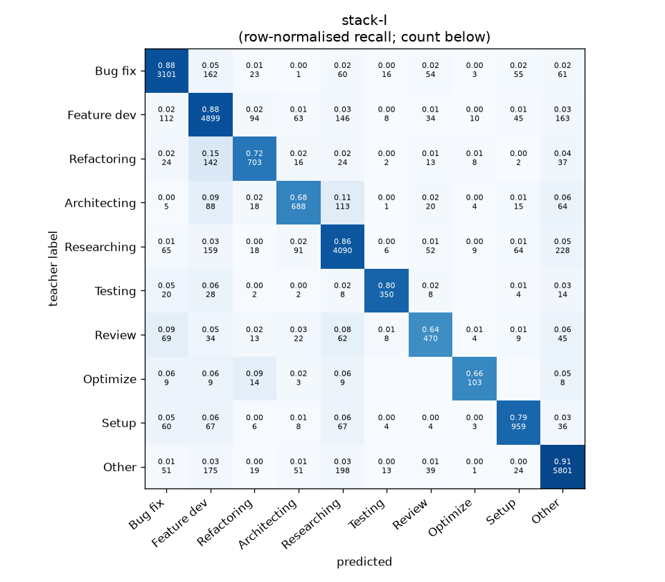
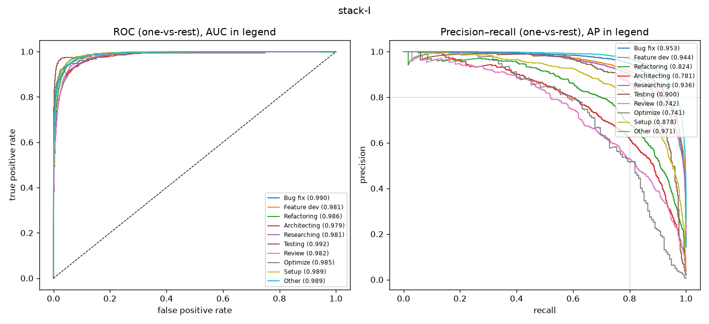

# stack-I

```
{
 "block": 7,
 "features": "stack of ft-qwen3-8b-lora, ft-qwen3-0.6b-lora, emb-qwen3-8b-instr_lr",
 "model": "meta-LR",
 "params": "{\"C\": 1.0, \"cw\": null}"
}
```

### stack-I

**Threshold metrics (argmax prediction)**

|              |   support (OOF) |   precision |   recall |    F1 | P 95% CI    | R 95% CI    | F1 95% CI   |   p(F1≤0.8) |
|:-------------|----------------:|------------:|---------:|------:|:------------|:------------|:------------|------------:|
| Bug fix      |            3536 |       0.882 |    0.877 | 0.879 | 0.861–0.902 | 0.855–0.898 | 0.864–0.895 |       0.000 |
| Feature dev  |            5574 |       0.850 |    0.879 | 0.864 | 0.831–0.868 | 0.862–0.895 | 0.850–0.876 |       0.000 |
| Refactoring  |             971 |       0.773 |    0.724 | 0.747 | 0.723–0.823 | 0.671–0.778 | 0.705–0.789 |       0.995 |
| Architecting |            1016 |       0.728 |    0.677 | 0.702 | 0.679–0.779 | 0.618–0.736 | 0.654–0.744 |       1.000 |
| Researching  |            4782 |       0.856 |    0.855 | 0.856 | 0.838–0.875 | 0.837–0.875 | 0.842–0.869 |       0.000 |
| Testing      |             436 |       0.858 |    0.803 | 0.829 | 0.794–0.918 | 0.725–0.872 | 0.772–0.881 |       0.163 |
| Review       |             736 |       0.677 |    0.639 | 0.657 | 0.620–0.739 | 0.571–0.712 | 0.606–0.713 |       1.000 |
| Optimize     |             155 |       0.710 |    0.665 | 0.687 | 0.585–0.857 | 0.538–0.821 | 0.571–0.795 |       0.982 |
| Setup        |            1214 |       0.815 |    0.790 | 0.802 | 0.776–0.856 | 0.746–0.832 | 0.767–0.836 |       0.461 |
| Other        |            6372 |       0.898 |    0.910 | 0.904 | 0.884–0.912 | 0.896–0.924 | 0.894–0.914 |       0.000 |

**Ranking metrics (class scores, one-vs-rest)**

|              |   ROC-AUC | ROC-AUC 95% CI   |   p(AUC=0.5) |   PR-AUC (AP) | PR-AUC 95% CI   |   PR-AUC chance (=prevalence) |
|:-------------|----------:|:-----------------|-------------:|--------------:|:----------------|------------------------------:|
| Bug fix      |     0.990 | 0.988–0.992      |        0.000 |         0.953 | 0.942–0.962     |                         0.143 |
| Feature dev  |     0.981 | 0.978–0.983      |        0.000 |         0.944 | 0.934–0.950     |                         0.225 |
| Refactoring  |     0.986 | 0.979–0.990      |        0.000 |         0.824 | 0.786–0.863     |                         0.039 |
| Architecting |     0.979 | 0.972–0.985      |        0.000 |         0.781 | 0.739–0.823     |                         0.041 |
| Researching  |     0.981 | 0.978–0.985      |        0.000 |         0.936 | 0.927–0.947     |                         0.193 |
| Testing      |     0.992 | 0.982–0.998      |        0.000 |         0.900 | 0.850–0.939     |                         0.018 |
| Review       |     0.982 | 0.972–0.989      |        0.000 |         0.742 | 0.681–0.804     |                         0.030 |
| Optimize     |     0.985 | 0.954–0.998      |        0.000 |         0.741 | 0.617–0.853     |                         0.006 |
| Setup        |     0.989 | 0.985–0.992      |        0.000 |         0.878 | 0.852–0.903     |                         0.049 |
| Other        |     0.989 | 0.987–0.990      |        0.000 |         0.971 | 0.966–0.976     |                         0.257 |

**Overall**

|                       |   value |      lo |      hi |   p-value |
|:----------------------|--------:|--------:|--------:|----------:|
| accuracy              |   0.854 |   0.844 |   0.862 |   nan     |
| macro-F1              |   0.793 |   0.776 |   0.810 |     0.005 |
| min-F1 (bar)          |   0.657 |   0.571 |   0.695 |     1.000 |
| classes with F1 ≥ 0.8 |   6.000 | nan     | nan     |   nan     |
| macro ROC-AUC         |   0.985 | nan     | nan     |   nan     |
| macro PR-AUC          |   0.867 | nan     | nan     |   nan     |




