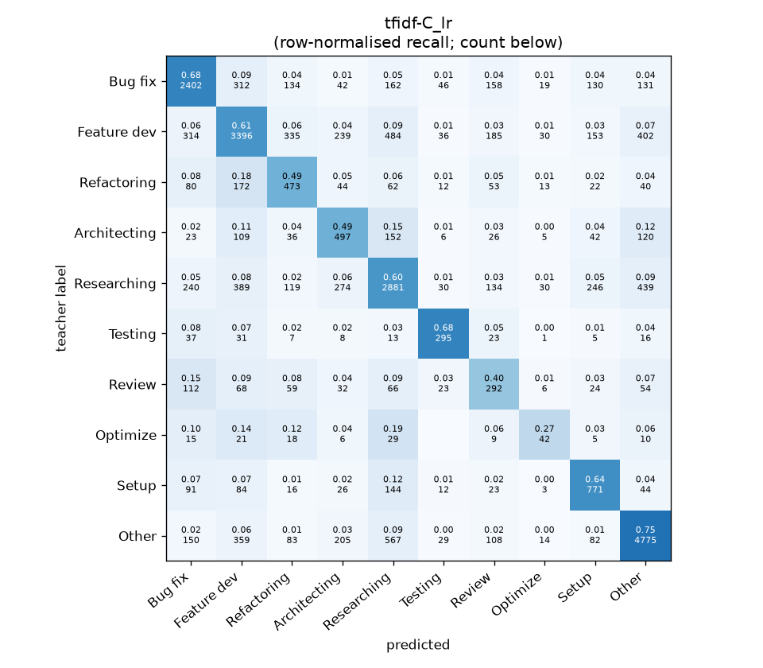
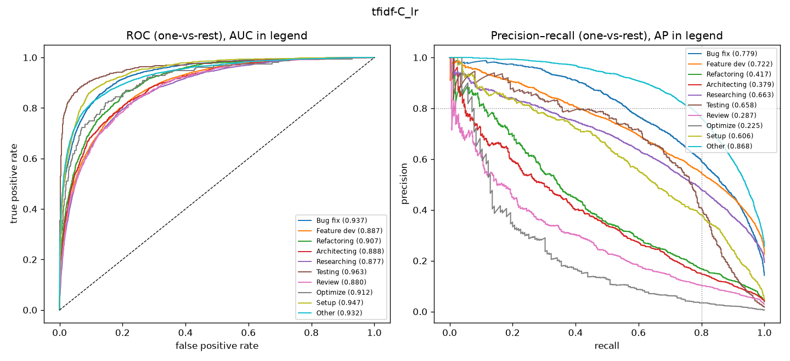

# tfidf-C_lr

```
{
 "block": 1,
 "features": "tfidf-C",
 "model": "lr",
 "selection": "fold-0 grid, min-F1 then macro-F1",
 "params": "{\"C\": 3.0, \"cw\": \"balanced\"}",
 "cv_seconds": 95.5,
 "full_fit_seconds": 57.1
}
```

### tfidf-C_lr

**Threshold metrics (argmax prediction)**

|              |   support (OOF) |   precision |   recall |    F1 | P 95% CI    | R 95% CI    | F1 95% CI   |   p(F1≤0.8) |
|:-------------|----------------:|------------:|---------:|------:|:------------|:------------|:------------|------------:|
| Bug fix      |            3536 |       0.693 |    0.679 | 0.686 | 0.666–0.719 | 0.645–0.710 | 0.660–0.708 |       1.000 |
| Feature dev  |            5574 |       0.687 |    0.609 | 0.646 | 0.665–0.711 | 0.582–0.635 | 0.623–0.667 |       1.000 |
| Refactoring  |             971 |       0.370 |    0.487 | 0.420 | 0.326–0.414 | 0.424–0.547 | 0.371–0.468 |       1.000 |
| Architecting |            1016 |       0.362 |    0.489 | 0.416 | 0.321–0.403 | 0.429–0.547 | 0.368–0.460 |       1.000 |
| Researching  |            4782 |       0.632 |    0.602 | 0.617 | 0.609–0.656 | 0.574–0.630 | 0.594–0.640 |       1.000 |
| Testing      |             436 |       0.603 |    0.677 | 0.638 | 0.528–0.673 | 0.587–0.761 | 0.566–0.701 |       1.000 |
| Review       |             736 |       0.289 |    0.397 | 0.334 | 0.240–0.340 | 0.321–0.467 | 0.276–0.390 |       1.000 |
| Optimize     |             155 |       0.258 |    0.271 | 0.264 | 0.139–0.394 | 0.128–0.410 | 0.137–0.391 |       1.000 |
| Setup        |            1214 |       0.521 |    0.635 | 0.572 | 0.482–0.561 | 0.581–0.690 | 0.533–0.612 |       1.000 |
| Other        |            6372 |       0.792 |    0.749 | 0.770 | 0.774–0.810 | 0.727–0.771 | 0.754–0.785 |       1.000 |

**Ranking metrics (class scores, one-vs-rest)**

|              |   ROC-AUC | ROC-AUC 95% CI   |   p(AUC=0.5) |   PR-AUC (AP) | PR-AUC 95% CI   |   PR-AUC chance (=prevalence) |
|:-------------|----------:|:-----------------|-------------:|--------------:|:----------------|------------------------------:|
| Bug fix      |     0.937 | 0.928–0.946      |        0.000 |         0.779 | 0.756–0.804     |                         0.143 |
| Feature dev  |     0.887 | 0.878–0.896      |        0.000 |         0.722 | 0.702–0.745     |                         0.225 |
| Refactoring  |     0.907 | 0.889–0.923      |        0.000 |         0.417 | 0.352–0.476     |                         0.039 |
| Architecting |     0.888 | 0.866–0.908      |        0.000 |         0.379 | 0.328–0.439     |                         0.041 |
| Researching  |     0.877 | 0.866–0.886      |        0.000 |         0.663 | 0.639–0.691     |                         0.193 |
| Testing      |     0.963 | 0.942–0.985      |        0.000 |         0.658 | 0.576–0.739     |                         0.018 |
| Review       |     0.880 | 0.860–0.906      |        0.000 |         0.287 | 0.233–0.368     |                         0.030 |
| Optimize     |     0.912 | 0.862–0.955      |        0.000 |         0.225 | 0.123–0.345     |                         0.006 |
| Setup        |     0.947 | 0.933–0.957      |        0.000 |         0.606 | 0.554–0.652     |                         0.049 |
| Other        |     0.932 | 0.926–0.939      |        0.000 |         0.868 | 0.855–0.880     |                         0.257 |

**Overall**

|                       |   value |      lo |      hi |   p-value |
|:----------------------|--------:|--------:|--------:|----------:|
| accuracy              |   0.638 |   0.625 |   0.650 |   nan     |
| macro-F1              |   0.536 |   0.517 |   0.556 |     0.005 |
| min-F1 (bar)          |   0.264 |   0.137 |   0.351 |     1.000 |
| classes with F1 ≥ 0.8 |   0.000 | nan     | nan     |   nan     |
| macro ROC-AUC         |   0.913 | nan     | nan     |   nan     |
| macro PR-AUC          |   0.560 | nan     | nan     |   nan     |




