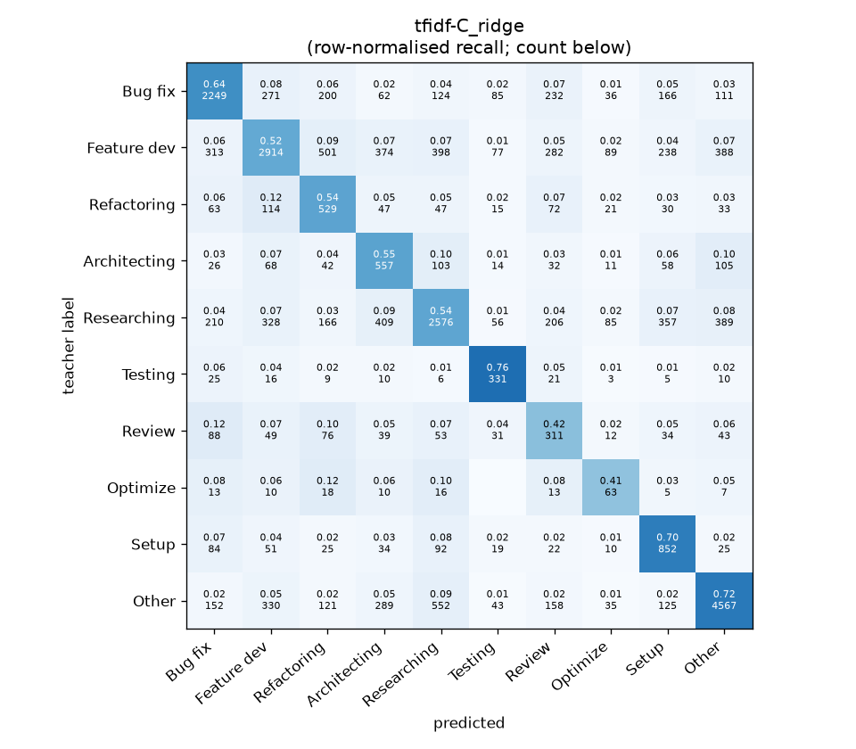
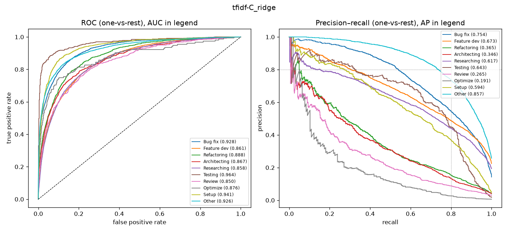

# tfidf-C_ridge

```
{
 "block": 1,
 "features": "tfidf-C",
 "model": "ridge",
 "selection": "fold-0 grid, min-F1 then macro-F1",
 "params": "{\"alpha\": 3.0, \"cw\": \"balanced\"}",
 "cv_seconds": 24.4,
 "full_fit_seconds": 16.9
}
```

### tfidf-C_ridge

**Threshold metrics (argmax prediction)**

|              |   support (OOF) |   precision |   recall |    F1 | P 95% CI    | R 95% CI    | F1 95% CI   |   p(F1≤0.8) |
|:-------------|----------------:|------------:|---------:|------:|:------------|:------------|:------------|------------:|
| Bug fix      |            3536 |       0.698 |    0.636 | 0.665 | 0.670–0.727 | 0.601–0.667 | 0.638–0.691 |       1.000 |
| Feature dev  |            5574 |       0.702 |    0.523 | 0.599 | 0.678–0.727 | 0.496–0.549 | 0.576–0.622 |       1.000 |
| Refactoring  |             971 |       0.314 |    0.545 | 0.398 | 0.279–0.350 | 0.481–0.605 | 0.356–0.440 |       1.000 |
| Architecting |            1016 |       0.304 |    0.548 | 0.391 | 0.271–0.337 | 0.484–0.606 | 0.350–0.432 |       1.000 |
| Researching  |            4782 |       0.649 |    0.539 | 0.589 | 0.624–0.677 | 0.511–0.564 | 0.565–0.613 |       1.000 |
| Testing      |             436 |       0.493 |    0.759 | 0.598 | 0.437–0.553 | 0.679–0.835 | 0.535–0.655 |       1.000 |
| Review       |             736 |       0.231 |    0.423 | 0.298 | 0.194–0.269 | 0.353–0.495 | 0.251–0.346 |       1.000 |
| Optimize     |             155 |       0.173 |    0.406 | 0.242 | 0.109–0.240 | 0.256–0.564 | 0.153–0.333 |       1.000 |
| Setup        |            1214 |       0.456 |    0.702 | 0.553 | 0.420–0.491 | 0.650–0.752 | 0.516–0.588 |       1.000 |
| Other        |            6372 |       0.804 |    0.717 | 0.758 | 0.786–0.823 | 0.692–0.738 | 0.740–0.774 |       1.000 |

**Ranking metrics (class scores, one-vs-rest)**

|              |   ROC-AUC | ROC-AUC 95% CI   |   p(AUC=0.5) |   PR-AUC (AP) | PR-AUC 95% CI   |   PR-AUC chance (=prevalence) |
|:-------------|----------:|:-----------------|-------------:|--------------:|:----------------|------------------------------:|
| Bug fix      |     0.928 | 0.918–0.936      |        0.000 |         0.754 | 0.726–0.779     |                         0.143 |
| Feature dev  |     0.861 | 0.849–0.871      |        0.000 |         0.673 | 0.654–0.697     |                         0.225 |
| Refactoring  |     0.888 | 0.866–0.909      |        0.000 |         0.365 | 0.315–0.425     |                         0.039 |
| Architecting |     0.867 | 0.841–0.894      |        0.000 |         0.346 | 0.296–0.404     |                         0.041 |
| Researching  |     0.858 | 0.846–0.869      |        0.000 |         0.617 | 0.592–0.645     |                         0.193 |
| Testing      |     0.964 | 0.944–0.982      |        0.000 |         0.643 | 0.553–0.725     |                         0.018 |
| Review       |     0.850 | 0.821–0.883      |        0.000 |         0.265 | 0.199–0.337     |                         0.030 |
| Optimize     |     0.876 | 0.803–0.937      |        0.000 |         0.191 | 0.102–0.305     |                         0.006 |
| Setup        |     0.941 | 0.927–0.954      |        0.000 |         0.594 | 0.545–0.640     |                         0.049 |
| Other        |     0.926 | 0.919–0.934      |        0.000 |         0.857 | 0.842–0.869     |                         0.257 |

**Overall**

|                       |   value |      lo |      hi |   p-value |
|:----------------------|--------:|--------:|--------:|----------:|
| accuracy              |   0.603 |   0.590 |   0.614 |   nan     |
| macro-F1              |   0.509 |   0.493 |   0.526 |     0.005 |
| min-F1 (bar)          |   0.242 |   0.153 |   0.309 |     1.000 |
| classes with F1 ≥ 0.8 |   0.000 | nan     | nan     |   nan     |
| macro ROC-AUC         |   0.896 | nan     | nan     |   nan     |
| macro PR-AUC          |   0.530 | nan     | nan     |   nan     |




