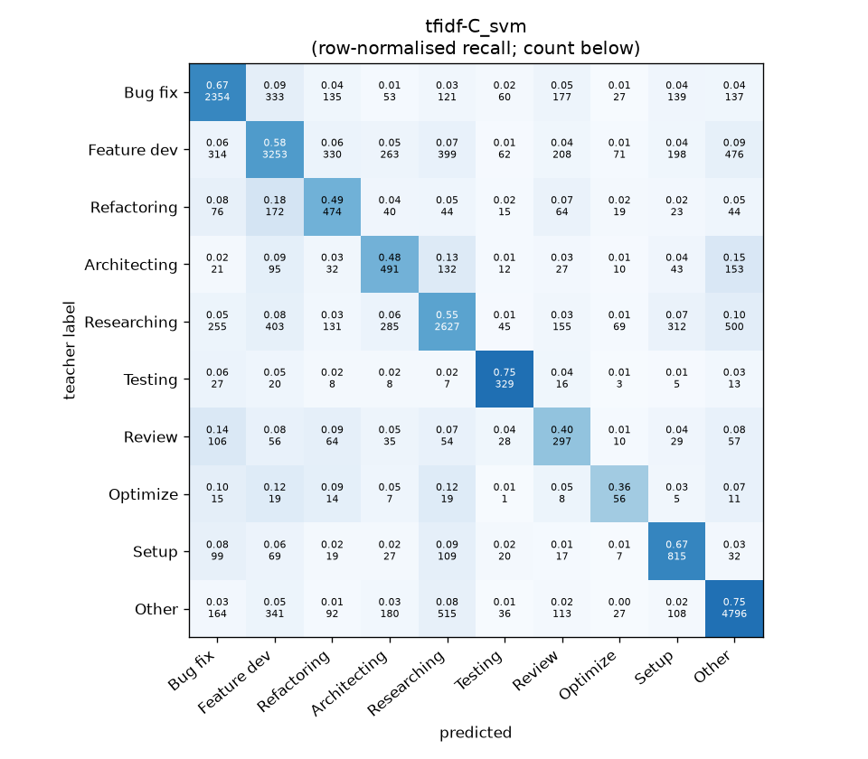
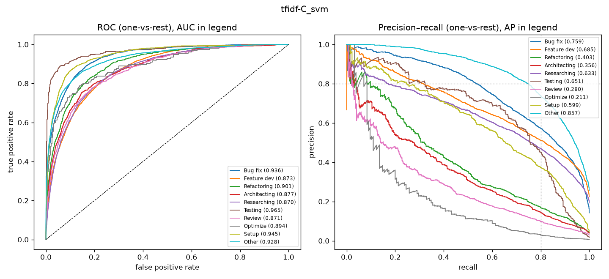

# tfidf-C_svm

```
{
 "block": 1,
 "features": "tfidf-C",
 "model": "svm",
 "selection": "fold-0 grid, min-F1 then macro-F1",
 "params": "{\"C\": 0.1, \"cw\": \"balanced\"}",
 "cv_seconds": 21.4,
 "full_fit_seconds": 13.9
}
```

### tfidf-C_svm

**Threshold metrics (argmax prediction)**

|              |   support (OOF) |   precision |   recall |    F1 | P 95% CI    | R 95% CI    | F1 95% CI   |   p(F1≤0.8) |
|:-------------|----------------:|------------:|---------:|------:|:------------|:------------|:------------|------------:|
| Bug fix      |            3536 |       0.686 |    0.666 | 0.676 | 0.660–0.715 | 0.635–0.698 | 0.651–0.699 |       1.000 |
| Feature dev  |            5574 |       0.683 |    0.584 | 0.630 | 0.658–0.706 | 0.558–0.609 | 0.608–0.650 |       1.000 |
| Refactoring  |             971 |       0.365 |    0.488 | 0.418 | 0.322–0.409 | 0.424–0.551 | 0.369–0.465 |       1.000 |
| Architecting |            1016 |       0.353 |    0.483 | 0.408 | 0.310–0.394 | 0.425–0.539 | 0.361–0.451 |       1.000 |
| Researching  |            4782 |       0.652 |    0.549 | 0.596 | 0.627–0.680 | 0.522–0.577 | 0.573–0.620 |       1.000 |
| Testing      |             436 |       0.541 |    0.755 | 0.630 | 0.479–0.604 | 0.670–0.835 | 0.563–0.688 |       1.000 |
| Review       |             736 |       0.274 |    0.404 | 0.327 | 0.230–0.322 | 0.326–0.473 | 0.269–0.379 |       1.000 |
| Optimize     |             155 |       0.187 |    0.361 | 0.247 | 0.115–0.268 | 0.205–0.538 | 0.149–0.351 |       1.000 |
| Setup        |            1214 |       0.486 |    0.671 | 0.564 | 0.446–0.523 | 0.620–0.726 | 0.525–0.602 |       1.000 |
| Other        |            6372 |       0.771 |    0.753 | 0.762 | 0.754–0.790 | 0.731–0.774 | 0.746–0.777 |       1.000 |

**Ranking metrics (class scores, one-vs-rest)**

|              |   ROC-AUC | ROC-AUC 95% CI   |   p(AUC=0.5) |   PR-AUC (AP) | PR-AUC 95% CI   |   PR-AUC chance (=prevalence) |
|:-------------|----------:|:-----------------|-------------:|--------------:|:----------------|------------------------------:|
| Bug fix      |     0.936 | 0.926–0.944      |        0.000 |         0.759 | 0.732–0.783     |                         0.143 |
| Feature dev  |     0.873 | 0.862–0.883      |        0.000 |         0.685 | 0.663–0.707     |                         0.225 |
| Refactoring  |     0.901 | 0.882–0.920      |        0.000 |         0.403 | 0.345–0.461     |                         0.039 |
| Architecting |     0.877 | 0.856–0.901      |        0.000 |         0.356 | 0.305–0.418     |                         0.041 |
| Researching  |     0.870 | 0.859–0.880      |        0.000 |         0.633 | 0.606–0.660     |                         0.193 |
| Testing      |     0.965 | 0.948–0.985      |        0.000 |         0.651 | 0.557–0.731     |                         0.018 |
| Review       |     0.871 | 0.848–0.898      |        0.000 |         0.280 | 0.216–0.364     |                         0.030 |
| Optimize     |     0.894 | 0.836–0.942      |        0.000 |         0.211 | 0.109–0.330     |                         0.006 |
| Setup        |     0.945 | 0.933–0.957      |        0.000 |         0.599 | 0.551–0.641     |                         0.049 |
| Other        |     0.928 | 0.920–0.935      |        0.000 |         0.857 | 0.843–0.869     |                         0.257 |

**Overall**

|                       |   value |      lo |      hi |   p-value |
|:----------------------|--------:|--------:|--------:|----------:|
| accuracy              |   0.625 |   0.612 |   0.637 |   nan     |
| macro-F1              |   0.526 |   0.508 |   0.543 |     0.005 |
| min-F1 (bar)          |   0.247 |   0.149 |   0.328 |     1.000 |
| classes with F1 ≥ 0.8 |   0.000 | nan     | nan     |   nan     |
| macro ROC-AUC         |   0.906 | nan     | nan     |   nan     |
| macro PR-AUC          |   0.543 | nan     | nan     |   nan     |




