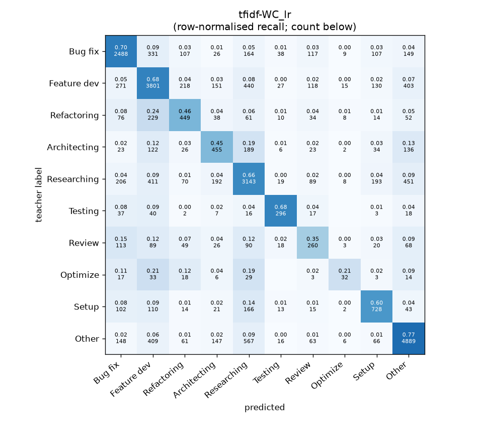
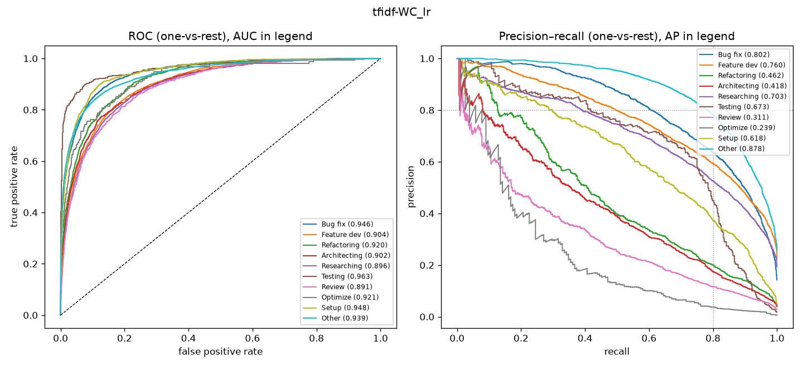

# tfidf-WC_lr

```
{
 "block": 1,
 "features": "tfidf-WC",
 "model": "lr",
 "selection": "fold-0 grid, min-F1 then macro-F1",
 "params": "{\"C\": 3.0, \"cw\": \"balanced\"}",
 "cv_seconds": 94.9,
 "full_fit_seconds": 78.4
}
```

### tfidf-WC_lr

**Threshold metrics (argmax prediction)**

|              |   support (OOF) |   precision |   recall |    F1 | P 95% CI    | R 95% CI    | F1 95% CI   |   p(F1≤0.8) |
|:-------------|----------------:|------------:|---------:|------:|:------------|:------------|:------------|------------:|
| Bug fix      |            3536 |       0.715 |    0.704 | 0.709 | 0.687–0.741 | 0.673–0.734 | 0.685–0.731 |       1.000 |
| Feature dev  |            5574 |       0.682 |    0.682 | 0.682 | 0.661–0.702 | 0.656–0.706 | 0.663–0.701 |       1.000 |
| Refactoring  |             971 |       0.443 |    0.462 | 0.452 | 0.393–0.498 | 0.395–0.523 | 0.401–0.503 |       1.000 |
| Architecting |            1016 |       0.426 |    0.448 | 0.436 | 0.375–0.475 | 0.394–0.508 | 0.387–0.487 |       1.000 |
| Researching  |            4782 |       0.646 |    0.657 | 0.652 | 0.625–0.670 | 0.628–0.685 | 0.630–0.673 |       1.000 |
| Testing      |             436 |       0.668 |    0.679 | 0.673 | 0.586–0.747 | 0.587–0.761 | 0.597–0.735 |       1.000 |
| Review       |             736 |       0.352 |    0.353 | 0.353 | 0.296–0.418 | 0.288–0.418 | 0.293–0.411 |       1.000 |
| Optimize     |             155 |       0.376 |    0.206 | 0.267 | 0.192–0.579 | 0.077–0.359 | 0.113–0.426 |       1.000 |
| Setup        |            1214 |       0.561 |    0.600 | 0.580 | 0.513–0.605 | 0.548–0.657 | 0.535–0.623 |       1.000 |
| Other        |            6372 |       0.786 |    0.767 | 0.776 | 0.768–0.805 | 0.746–0.788 | 0.761–0.792 |       1.000 |

**Ranking metrics (class scores, one-vs-rest)**

|              |   ROC-AUC | ROC-AUC 95% CI   |   p(AUC=0.5) |   PR-AUC (AP) | PR-AUC 95% CI   |   PR-AUC chance (=prevalence) |
|:-------------|----------:|:-----------------|-------------:|--------------:|:----------------|------------------------------:|
| Bug fix      |     0.946 | 0.938–0.953      |        0.000 |         0.802 | 0.779–0.822     |                         0.143 |
| Feature dev  |     0.904 | 0.894–0.911      |        0.000 |         0.760 | 0.741–0.781     |                         0.225 |
| Refactoring  |     0.920 | 0.904–0.934      |        0.000 |         0.462 | 0.401–0.522     |                         0.039 |
| Architecting |     0.902 | 0.885–0.920      |        0.000 |         0.418 | 0.359–0.476     |                         0.041 |
| Researching  |     0.896 | 0.886–0.904      |        0.000 |         0.703 | 0.681–0.727     |                         0.193 |
| Testing      |     0.963 | 0.943–0.985      |        0.000 |         0.673 | 0.591–0.748     |                         0.018 |
| Review       |     0.891 | 0.871–0.917      |        0.000 |         0.311 | 0.244–0.390     |                         0.030 |
| Optimize     |     0.921 | 0.871–0.959      |        0.000 |         0.239 | 0.132–0.384     |                         0.006 |
| Setup        |     0.948 | 0.937–0.960      |        0.000 |         0.618 | 0.565–0.661     |                         0.049 |
| Other        |     0.939 | 0.932–0.945      |        0.000 |         0.878 | 0.865–0.889     |                         0.257 |

**Overall**

|                       |   value |      lo |      hi |   p-value |
|:----------------------|--------:|--------:|--------:|----------:|
| accuracy              |   0.667 |   0.655 |   0.679 |   nan     |
| macro-F1              |   0.558 |   0.537 |   0.579 |     0.005 |
| min-F1 (bar)          |   0.267 |   0.113 |   0.368 |     1.000 |
| classes with F1 ≥ 0.8 |   0.000 | nan     | nan     |   nan     |
| macro ROC-AUC         |   0.923 | nan     | nan     |   nan     |
| macro PR-AUC          |   0.586 | nan     | nan     |   nan     |




