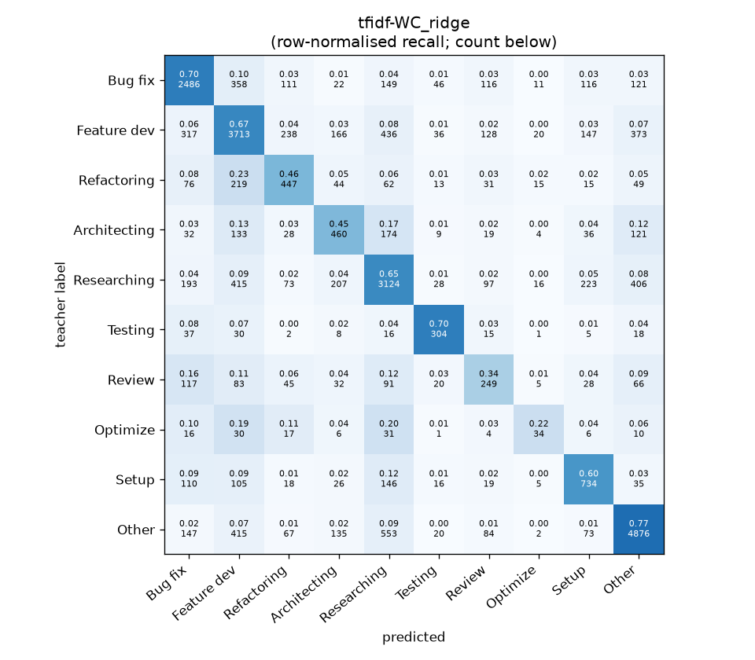
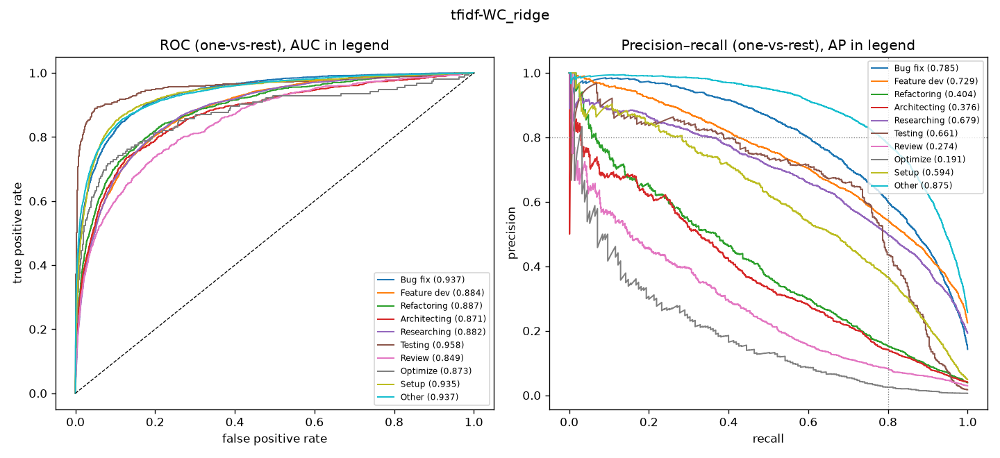

# tfidf-WC_ridge

```
{
 "block": 1,
 "features": "tfidf-WC",
 "model": "ridge",
 "selection": "fold-0 grid, min-F1 then macro-F1",
 "params": "{\"alpha\": 1.0, \"cw\": \"balanced\"}",
 "cv_seconds": 47.6,
 "full_fit_seconds": 32.5
}
```

### tfidf-WC_ridge

**Threshold metrics (argmax prediction)**

|              |   support (OOF) |   precision |   recall |    F1 | P 95% CI    | R 95% CI    | F1 95% CI   |   p(F1≤0.8) |
|:-------------|----------------:|------------:|---------:|------:|:------------|:------------|:------------|------------:|
| Bug fix      |            3536 |       0.704 |    0.703 | 0.704 | 0.676–0.733 | 0.672–0.732 | 0.679–0.726 |       1.000 |
| Feature dev  |            5574 |       0.675 |    0.666 | 0.671 | 0.653–0.695 | 0.643–0.691 | 0.651–0.689 |       1.000 |
| Refactoring  |             971 |       0.427 |    0.460 | 0.443 | 0.383–0.480 | 0.399–0.523 | 0.396–0.495 |       1.000 |
| Architecting |            1016 |       0.416 |    0.453 | 0.434 | 0.367–0.467 | 0.398–0.512 | 0.386–0.485 |       1.000 |
| Researching  |            4782 |       0.653 |    0.653 | 0.653 | 0.632–0.676 | 0.628–0.682 | 0.634–0.674 |       1.000 |
| Testing      |             436 |       0.617 |    0.697 | 0.654 | 0.539–0.693 | 0.606–0.780 | 0.581–0.716 |       1.000 |
| Review       |             736 |       0.327 |    0.338 | 0.332 | 0.270–0.388 | 0.272–0.408 | 0.274–0.393 |       1.000 |
| Optimize     |             155 |       0.301 |    0.219 | 0.254 | 0.151–0.478 | 0.103–0.359 | 0.119–0.400 |       1.000 |
| Setup        |            1214 |       0.531 |    0.605 | 0.565 | 0.485–0.572 | 0.551–0.657 | 0.522–0.606 |       1.000 |
| Other        |            6372 |       0.803 |    0.765 | 0.783 | 0.784–0.820 | 0.743–0.787 | 0.768–0.799 |       0.984 |

**Ranking metrics (class scores, one-vs-rest)**

|              |   ROC-AUC | ROC-AUC 95% CI   |   p(AUC=0.5) |   PR-AUC (AP) | PR-AUC 95% CI   |   PR-AUC chance (=prevalence) |
|:-------------|----------:|:-----------------|-------------:|--------------:|:----------------|------------------------------:|
| Bug fix      |     0.937 | 0.928–0.945      |        0.000 |         0.785 | 0.760–0.808     |                         0.143 |
| Feature dev  |     0.884 | 0.876–0.894      |        0.000 |         0.729 | 0.712–0.750     |                         0.225 |
| Refactoring  |     0.887 | 0.862–0.912      |        0.000 |         0.404 | 0.350–0.465     |                         0.039 |
| Architecting |     0.871 | 0.849–0.896      |        0.000 |         0.376 | 0.327–0.441     |                         0.041 |
| Researching  |     0.882 | 0.872–0.891      |        0.000 |         0.679 | 0.655–0.701     |                         0.193 |
| Testing      |     0.958 | 0.933–0.983      |        0.000 |         0.661 | 0.575–0.739     |                         0.018 |
| Review       |     0.849 | 0.820–0.883      |        0.000 |         0.274 | 0.214–0.354     |                         0.030 |
| Optimize     |     0.873 | 0.806–0.941      |        0.000 |         0.191 | 0.107–0.336     |                         0.006 |
| Setup        |     0.935 | 0.919–0.950      |        0.000 |         0.594 | 0.545–0.646     |                         0.049 |
| Other        |     0.937 | 0.929–0.943      |        0.000 |         0.875 | 0.863–0.887     |                         0.257 |

**Overall**

|                       |   value |      lo |      hi |   p-value |
|:----------------------|--------:|--------:|--------:|----------:|
| accuracy              |   0.663 |   0.651 |   0.675 |   nan     |
| macro-F1              |   0.549 |   0.530 |   0.570 |     0.005 |
| min-F1 (bar)          |   0.254 |   0.119 |   0.351 |     1.000 |
| classes with F1 ≥ 0.8 |   0.000 | nan     | nan     |   nan     |
| macro ROC-AUC         |   0.901 | nan     | nan     |   nan     |
| macro PR-AUC          |   0.557 | nan     | nan     |   nan     |




