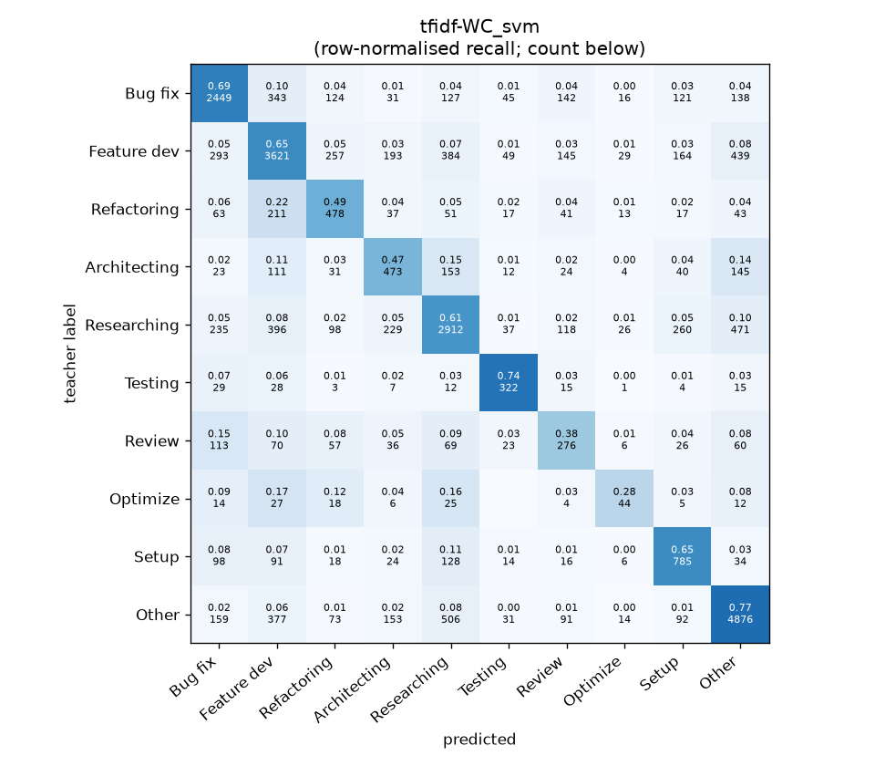
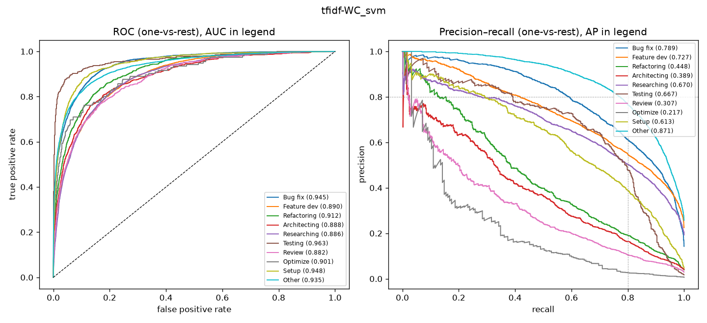

# tfidf-WC_svm

```
{
 "block": 1,
 "features": "tfidf-WC",
 "model": "svm",
 "selection": "fold-0 grid, min-F1 then macro-F1",
 "params": "{\"C\": 0.1, \"cw\": \"balanced\"}",
 "cv_seconds": 19.5,
 "full_fit_seconds": 17.2
}
```

### tfidf-WC_svm

**Threshold metrics (argmax prediction)**

|              |   support (OOF) |   precision |   recall |    F1 | P 95% CI    | R 95% CI    | F1 95% CI   |   p(F1≤0.8) |
|:-------------|----------------:|------------:|---------:|------:|:------------|:------------|:------------|------------:|
| Bug fix      |            3536 |       0.705 |    0.693 | 0.699 | 0.677–0.731 | 0.662–0.722 | 0.673–0.719 |       1.000 |
| Feature dev  |            5574 |       0.686 |    0.650 | 0.668 | 0.665–0.708 | 0.623–0.675 | 0.647–0.686 |       1.000 |
| Refactoring  |             971 |       0.413 |    0.492 | 0.449 | 0.367–0.465 | 0.432–0.564 | 0.400–0.500 |       1.000 |
| Architecting |            1016 |       0.398 |    0.466 | 0.429 | 0.353–0.441 | 0.409–0.520 | 0.383–0.475 |       1.000 |
| Researching  |            4782 |       0.667 |    0.609 | 0.637 | 0.645–0.692 | 0.580–0.637 | 0.615–0.660 |       1.000 |
| Testing      |             436 |       0.585 |    0.739 | 0.653 | 0.517–0.656 | 0.651–0.817 | 0.585–0.712 |       1.000 |
| Review       |             736 |       0.317 |    0.375 | 0.343 | 0.263–0.370 | 0.304–0.446 | 0.284–0.399 |       1.000 |
| Optimize     |             155 |       0.277 |    0.284 | 0.280 | 0.158–0.421 | 0.154–0.436 | 0.154–0.411 |       1.000 |
| Setup        |            1214 |       0.518 |    0.647 | 0.576 | 0.475–0.556 | 0.594–0.703 | 0.533–0.616 |       1.000 |
| Other        |            6372 |       0.782 |    0.765 | 0.774 | 0.764–0.801 | 0.743–0.787 | 0.758–0.790 |       1.000 |

**Ranking metrics (class scores, one-vs-rest)**

|              |   ROC-AUC | ROC-AUC 95% CI   |   p(AUC=0.5) |   PR-AUC (AP) | PR-AUC 95% CI   |   PR-AUC chance (=prevalence) |
|:-------------|----------:|:-----------------|-------------:|--------------:|:----------------|------------------------------:|
| Bug fix      |     0.945 | 0.936–0.953      |        0.000 |         0.789 | 0.764–0.812     |                         0.143 |
| Feature dev  |     0.890 | 0.879–0.899      |        0.000 |         0.727 | 0.708–0.747     |                         0.225 |
| Refactoring  |     0.912 | 0.893–0.929      |        0.000 |         0.448 | 0.394–0.508     |                         0.039 |
| Architecting |     0.888 | 0.869–0.910      |        0.000 |         0.389 | 0.339–0.453     |                         0.041 |
| Researching  |     0.886 | 0.876–0.895      |        0.000 |         0.670 | 0.646–0.695     |                         0.193 |
| Testing      |     0.963 | 0.942–0.985      |        0.000 |         0.667 | 0.582–0.744     |                         0.018 |
| Review       |     0.882 | 0.860–0.908      |        0.000 |         0.307 | 0.242–0.388     |                         0.030 |
| Optimize     |     0.901 | 0.851–0.947      |        0.000 |         0.217 | 0.113–0.349     |                         0.006 |
| Setup        |     0.948 | 0.936–0.959      |        0.000 |         0.613 | 0.564–0.657     |                         0.049 |
| Other        |     0.935 | 0.927–0.942      |        0.000 |         0.871 | 0.859–0.883     |                         0.257 |

**Overall**

|                       |   value |      lo |      hi |   p-value |
|:----------------------|--------:|--------:|--------:|----------:|
| accuracy              |   0.655 |   0.643 |   0.667 |   nan     |
| macro-F1              |   0.551 |   0.531 |   0.570 |     0.005 |
| min-F1 (bar)          |   0.280 |   0.154 |   0.364 |     1.000 |
| classes with F1 ≥ 0.8 |   0.000 | nan     | nan     |   nan     |
| macro ROC-AUC         |   0.915 | nan     | nan     |   nan     |
| macro PR-AUC          |   0.570 | nan     | nan     |   nan     |




