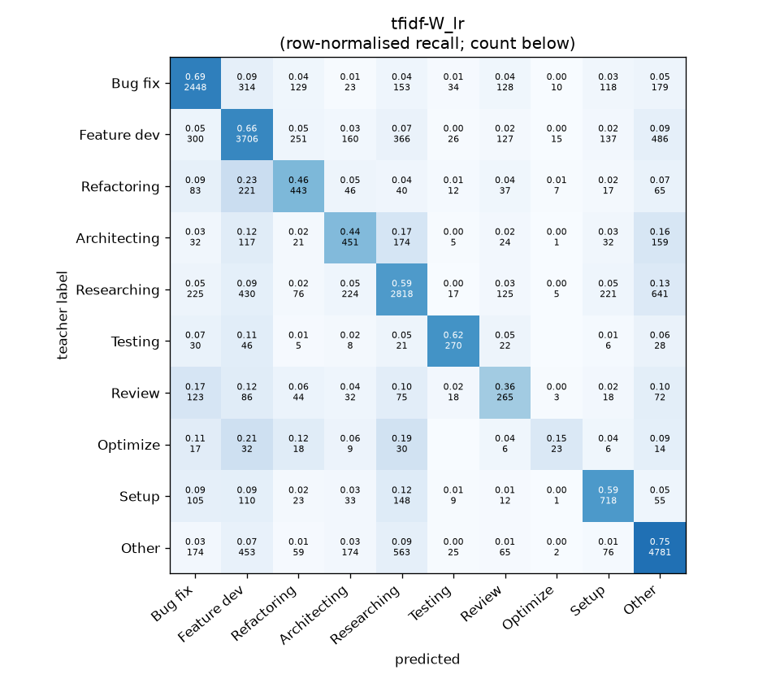
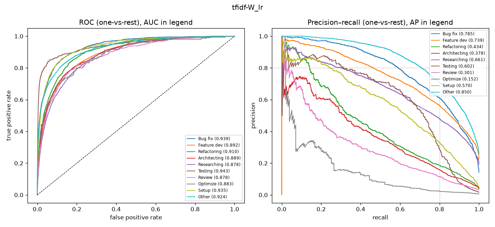

# tfidf-W_lr

```
{
 "block": 1,
 "features": "tfidf-W",
 "model": "lr",
 "selection": "fold-0 grid, min-F1 then macro-F1",
 "params": "{\"C\": 3.0, \"cw\": \"balanced\"}",
 "cv_seconds": 185.5,
 "full_fit_seconds": 68.3
}
```

### tfidf-W_lr

**Threshold metrics (argmax prediction)**

|              |   support (OOF) |   precision |   recall |    F1 | P 95% CI    | R 95% CI    | F1 95% CI   |   p(F1≤0.8) |
|:-------------|----------------:|------------:|---------:|------:|:------------|:------------|:------------|------------:|
| Bug fix      |            3536 |       0.692 |    0.692 | 0.692 | 0.666–0.718 | 0.661–0.723 | 0.667–0.716 |       1.000 |
| Feature dev  |            5574 |       0.672 |    0.665 | 0.668 | 0.651–0.693 | 0.639–0.689 | 0.649–0.686 |       1.000 |
| Refactoring  |             971 |       0.414 |    0.456 | 0.434 | 0.365–0.467 | 0.391–0.523 | 0.380–0.486 |       1.000 |
| Architecting |            1016 |       0.389 |    0.444 | 0.415 | 0.343–0.435 | 0.386–0.500 | 0.367–0.458 |       1.000 |
| Researching  |            4782 |       0.642 |    0.589 | 0.615 | 0.619–0.668 | 0.562–0.618 | 0.591–0.637 |       1.000 |
| Testing      |             436 |       0.649 |    0.619 | 0.634 | 0.563–0.731 | 0.523–0.706 | 0.551–0.708 |       1.000 |
| Review       |             736 |       0.327 |    0.360 | 0.343 | 0.274–0.386 | 0.288–0.429 | 0.285–0.401 |       1.000 |
| Optimize     |             155 |       0.343 |    0.148 | 0.207 | 0.125–0.611 | 0.051–0.256 | 0.074–0.353 |       1.000 |
| Setup        |            1214 |       0.532 |    0.591 | 0.560 | 0.486–0.575 | 0.535–0.647 | 0.518–0.603 |       1.000 |
| Other        |            6372 |       0.738 |    0.750 | 0.744 | 0.720–0.756 | 0.728–0.773 | 0.728–0.760 |       1.000 |

**Ranking metrics (class scores, one-vs-rest)**

|              |   ROC-AUC | ROC-AUC 95% CI   |   p(AUC=0.5) |   PR-AUC (AP) | PR-AUC 95% CI   |   PR-AUC chance (=prevalence) |
|:-------------|----------:|:-----------------|-------------:|--------------:|:----------------|------------------------------:|
| Bug fix      |     0.939 | 0.930–0.946      |        0.000 |         0.785 | 0.763–0.808     |                         0.143 |
| Feature dev  |     0.892 | 0.881–0.899      |        0.000 |         0.739 | 0.715–0.759     |                         0.225 |
| Refactoring  |     0.910 | 0.890–0.927      |        0.000 |         0.434 | 0.380–0.490     |                         0.039 |
| Architecting |     0.889 | 0.864–0.910      |        0.000 |         0.378 | 0.322–0.443     |                         0.041 |
| Researching  |     0.878 | 0.868–0.888      |        0.000 |         0.661 | 0.638–0.685     |                         0.193 |
| Testing      |     0.943 | 0.921–0.971      |        0.000 |         0.602 | 0.516–0.688     |                         0.018 |
| Review       |     0.878 | 0.854–0.906      |        0.000 |         0.301 | 0.244–0.381     |                         0.030 |
| Optimize     |     0.883 | 0.827–0.933      |        0.000 |         0.152 | 0.079–0.274     |                         0.006 |
| Setup        |     0.935 | 0.919–0.947      |        0.000 |         0.570 | 0.518–0.628     |                         0.049 |
| Other        |     0.924 | 0.915–0.930      |        0.000 |         0.850 | 0.836–0.861     |                         0.257 |

**Overall**

|                       |   value |      lo |      hi |   p-value |
|:----------------------|--------:|--------:|--------:|----------:|
| accuracy              |   0.642 |   0.631 |   0.654 |   nan     |
| macro-F1              |   0.531 |   0.510 |   0.552 |     0.005 |
| min-F1 (bar)          |   0.207 |   0.074 |   0.332 |     1.000 |
| classes with F1 ≥ 0.8 |   0.000 | nan     | nan     |   nan     |
| macro ROC-AUC         |   0.907 | nan     | nan     |   nan     |
| macro PR-AUC          |   0.547 | nan     | nan     |   nan     |




