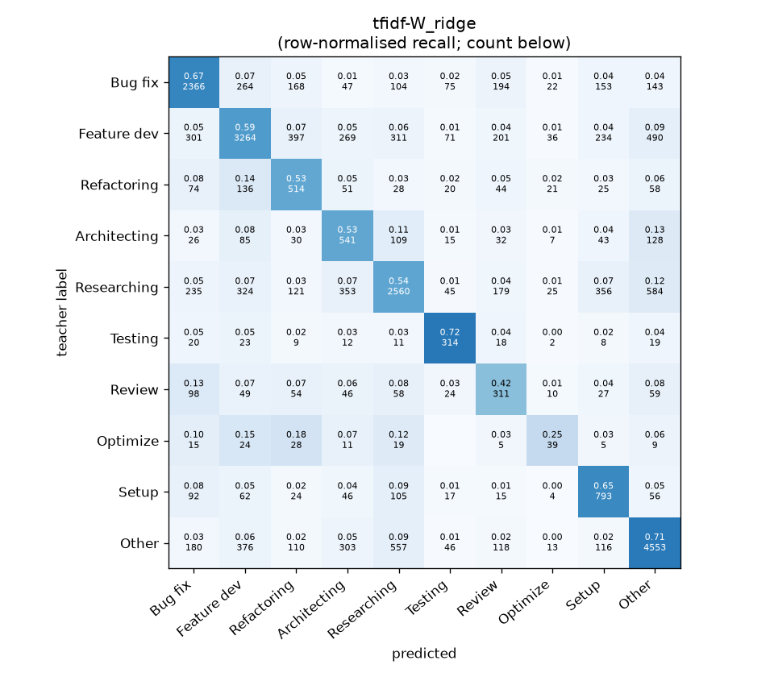
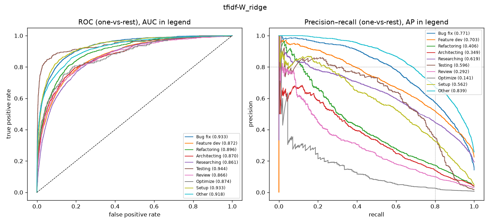

# tfidf-W_ridge

```
{
 "block": 1,
 "features": "tfidf-W",
 "model": "ridge",
 "selection": "fold-0 grid, min-F1 then macro-F1",
 "params": "{\"alpha\": 3.0, \"cw\": \"balanced\"}",
 "cv_seconds": 10.4,
 "full_fit_seconds": 7.1
}
```

### tfidf-W_ridge

**Threshold metrics (argmax prediction)**

|              |   support (OOF) |   precision |   recall |    F1 | P 95% CI    | R 95% CI    | F1 95% CI   |   p(F1≤0.8) |
|:-------------|----------------:|------------:|---------:|------:|:------------|:------------|:------------|------------:|
| Bug fix      |            3536 |       0.694 |    0.669 | 0.682 | 0.666–0.722 | 0.637–0.699 | 0.656–0.706 |       1.000 |
| Feature dev  |            5574 |       0.708 |    0.586 | 0.641 | 0.685–0.731 | 0.558–0.613 | 0.619–0.663 |       1.000 |
| Refactoring  |             971 |       0.353 |    0.529 | 0.424 | 0.315–0.392 | 0.465–0.593 | 0.380–0.471 |       1.000 |
| Architecting |            1016 |       0.322 |    0.532 | 0.401 | 0.289–0.358 | 0.472–0.591 | 0.361–0.444 |       1.000 |
| Researching  |            4782 |       0.663 |    0.535 | 0.592 | 0.637–0.691 | 0.508–0.565 | 0.567–0.617 |       1.000 |
| Testing      |             436 |       0.501 |    0.720 | 0.591 | 0.440–0.562 | 0.633–0.807 | 0.526–0.655 |       1.000 |
| Review       |             736 |       0.278 |    0.423 | 0.336 | 0.233–0.323 | 0.348–0.495 | 0.283–0.386 |       1.000 |
| Optimize     |             155 |       0.218 |    0.252 | 0.234 | 0.114–0.340 | 0.128–0.385 | 0.119–0.353 |       1.000 |
| Setup        |            1214 |       0.451 |    0.653 | 0.533 | 0.416–0.485 | 0.601–0.706 | 0.495–0.571 |       1.000 |
| Other        |            6372 |       0.747 |    0.715 | 0.730 | 0.728–0.765 | 0.694–0.738 | 0.714–0.748 |       1.000 |

**Ranking metrics (class scores, one-vs-rest)**

|              |   ROC-AUC | ROC-AUC 95% CI   |   p(AUC=0.5) |   PR-AUC (AP) | PR-AUC 95% CI   |   PR-AUC chance (=prevalence) |
|:-------------|----------:|:-----------------|-------------:|--------------:|:----------------|------------------------------:|
| Bug fix      |     0.933 | 0.923–0.941      |        0.000 |         0.771 | 0.747–0.795     |                         0.143 |
| Feature dev  |     0.872 | 0.861–0.882      |        0.000 |         0.703 | 0.680–0.726     |                         0.225 |
| Refactoring  |     0.896 | 0.871–0.914      |        0.000 |         0.406 | 0.355–0.463     |                         0.039 |
| Architecting |     0.870 | 0.845–0.893      |        0.000 |         0.349 | 0.297–0.411     |                         0.041 |
| Researching  |     0.861 | 0.850–0.871      |        0.000 |         0.619 | 0.596–0.642     |                         0.193 |
| Testing      |     0.944 | 0.917–0.972      |        0.000 |         0.596 | 0.508–0.685     |                         0.018 |
| Review       |     0.866 | 0.843–0.896      |        0.000 |         0.292 | 0.234–0.369     |                         0.030 |
| Optimize     |     0.874 | 0.812–0.918      |        0.000 |         0.141 | 0.073–0.262     |                         0.006 |
| Setup        |     0.933 | 0.917–0.946      |        0.000 |         0.562 | 0.510–0.618     |                         0.049 |
| Other        |     0.918 | 0.910–0.926      |        0.000 |         0.839 | 0.827–0.850     |                         0.257 |

**Overall**

|                       |   value |      lo |      hi |   p-value |
|:----------------------|--------:|--------:|--------:|----------:|
| accuracy              |   0.615 |   0.603 |   0.628 |   nan     |
| macro-F1              |   0.516 |   0.499 |   0.535 |     0.005 |
| min-F1 (bar)          |   0.234 |   0.119 |   0.333 |     1.000 |
| classes with F1 ≥ 0.8 |   0.000 | nan     | nan     |   nan     |
| macro ROC-AUC         |   0.897 | nan     | nan     |   nan     |
| macro PR-AUC          |   0.528 | nan     | nan     |   nan     |




