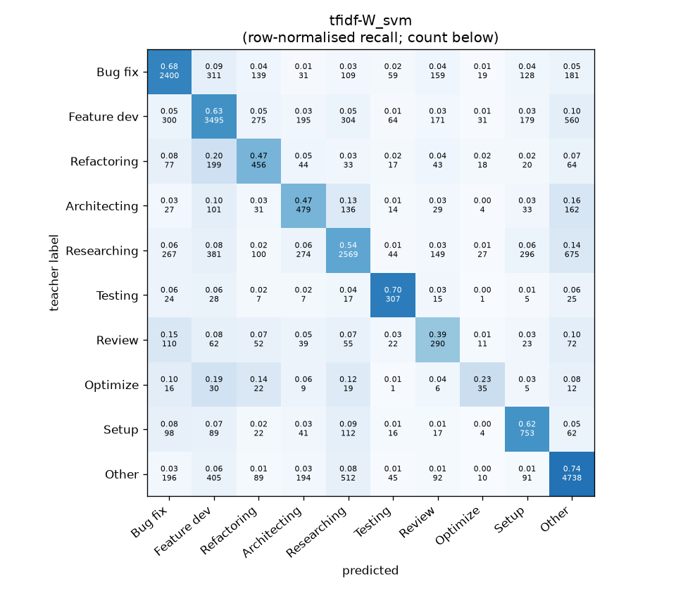
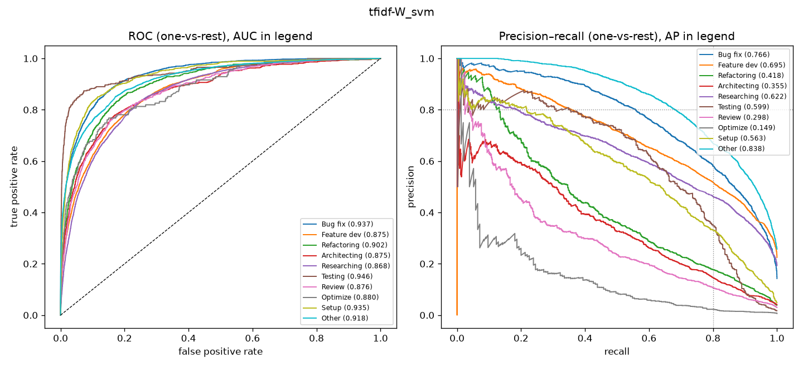

# tfidf-W_svm

```
{
 "block": 1,
 "features": "tfidf-W",
 "model": "svm",
 "selection": "fold-0 grid, min-F1 then macro-F1",
 "params": "{\"C\": 0.1, \"cw\": \"balanced\"}",
 "cv_seconds": 10.3,
 "full_fit_seconds": 7.4
}
```

### tfidf-W_svm

**Threshold metrics (argmax prediction)**

|              |   support (OOF) |   precision |   recall |    F1 | P 95% CI    | R 95% CI    | F1 95% CI   |   p(F1≤0.8) |
|:-------------|----------------:|------------:|---------:|------:|:------------|:------------|:------------|------------:|
| Bug fix      |            3536 |       0.683 |    0.679 | 0.681 | 0.656–0.711 | 0.647–0.710 | 0.654–0.705 |       1.000 |
| Feature dev  |            5574 |       0.685 |    0.627 | 0.655 | 0.662–0.706 | 0.600–0.654 | 0.634–0.676 |       1.000 |
| Refactoring  |             971 |       0.382 |    0.470 | 0.421 | 0.334–0.429 | 0.399–0.535 | 0.368–0.469 |       1.000 |
| Architecting |            1016 |       0.365 |    0.471 | 0.411 | 0.324–0.405 | 0.413–0.528 | 0.366–0.454 |       1.000 |
| Researching  |            4782 |       0.665 |    0.537 | 0.594 | 0.639–0.692 | 0.508–0.565 | 0.569–0.620 |       1.000 |
| Testing      |             436 |       0.521 |    0.704 | 0.599 | 0.453–0.591 | 0.615–0.789 | 0.532–0.662 |       1.000 |
| Review       |             736 |       0.299 |    0.394 | 0.340 | 0.250–0.349 | 0.321–0.467 | 0.283–0.398 |       1.000 |
| Optimize     |             155 |       0.219 |    0.226 | 0.222 | 0.108–0.348 | 0.103–0.359 | 0.107–0.345 |       1.000 |
| Setup        |            1214 |       0.491 |    0.620 | 0.548 | 0.449–0.531 | 0.564–0.673 | 0.505–0.590 |       1.000 |
| Other        |            6372 |       0.723 |    0.744 | 0.733 | 0.706–0.741 | 0.723–0.765 | 0.717–0.750 |       1.000 |

**Ranking metrics (class scores, one-vs-rest)**

|              |   ROC-AUC | ROC-AUC 95% CI   |   p(AUC=0.5) |   PR-AUC (AP) | PR-AUC 95% CI   |   PR-AUC chance (=prevalence) |
|:-------------|----------:|:-----------------|-------------:|--------------:|:----------------|------------------------------:|
| Bug fix      |     0.937 | 0.929–0.945      |        0.000 |         0.766 | 0.741–0.793     |                         0.143 |
| Feature dev  |     0.875 | 0.865–0.885      |        0.000 |         0.695 | 0.674–0.717     |                         0.225 |
| Refactoring  |     0.902 | 0.881–0.922      |        0.000 |         0.418 | 0.364–0.479     |                         0.039 |
| Architecting |     0.875 | 0.852–0.897      |        0.000 |         0.355 | 0.303–0.418     |                         0.041 |
| Researching  |     0.868 | 0.857–0.877      |        0.000 |         0.622 | 0.599–0.646     |                         0.193 |
| Testing      |     0.946 | 0.923–0.973      |        0.000 |         0.599 | 0.513–0.690     |                         0.018 |
| Review       |     0.876 | 0.855–0.903      |        0.000 |         0.298 | 0.240–0.375     |                         0.030 |
| Optimize     |     0.880 | 0.826–0.923      |        0.000 |         0.149 | 0.078–0.271     |                         0.006 |
| Setup        |     0.935 | 0.919–0.947      |        0.000 |         0.563 | 0.512–0.618     |                         0.049 |
| Other        |     0.918 | 0.909–0.925      |        0.000 |         0.838 | 0.824–0.850     |                         0.257 |

**Overall**

|                       |   value |      lo |      hi |   p-value |
|:----------------------|--------:|--------:|--------:|----------:|
| accuracy              |   0.626 |   0.614 |   0.638 |   nan     |
| macro-F1              |   0.520 |   0.502 |   0.540 |     0.005 |
| min-F1 (bar)          |   0.222 |   0.107 |   0.333 |     1.000 |
| classes with F1 ≥ 0.8 |   0.000 | nan     | nan     |   nan     |
| macro ROC-AUC         |   0.901 | nan     | nan     |   nan     |
| macro PR-AUC          |   0.530 | nan     | nan     |   nan     |




